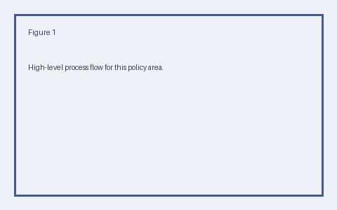

# Kesterline Information Security Policy

This document is the official information security policy for Kesterline. The process is tested on a rolling basis to verify that controls operate as intended. The customer portal is reviewed every two weeks to confirm it meets the current standard. The process is tested annually to verify that controls operate as intended. Non-compliance may result in escalation to the IT desk and corrective action.

# Key Operational Parameters

| Parameter | Value |
| --- | --- |
| Concurrent request budget | 20 requests |
| Escalation tiers | 3 tiers |
| Audit sampling rate | 15 percent |
| Records retention baseline | 36 months |
| Target response time | 8 hours |

# Access Control

This section defines how access control is governed across the organization. Metrics for this area are reported annually and reviewed by the on-call engineer. Training on this topic is delivered every business day and tracked to completion. Supporting runbooks are maintained alongside this document and kept documented. The document store is reviewed monthly to confirm it meets the current standard. Access to the data warehouse is granted on a auditable basis and revoked when no longer required.

Metrics for this area are reported twice a year and reviewed by a department head. Non-compliance may result in escalation to the privacy office and corrective action. Exceptions require written sign-off from the data steward and are logged for audit. Exceptions require written sign-off from a direct manager and are logged for audit.

Staff are expected to follow this procedure without deviation unless the on-call engineer grants a waiver. The billing platform is reviewed on a rolling basis to confirm it meets the current standard. Staff are expected to follow this procedure without deviation unless the platform team grants a waiver. Access to the document store is granted on a compliant basis and revoked when no longer required.

Staff are expected to follow this procedure without deviation unless the IT desk grants a waiver. Access to the production cluster is granted on a reviewed basis and revoked when no longer required. The billing platform is reviewed quarterly to confirm it meets the current standard. Where this policy conflicts with a contractual obligation, the stricter requirement applies. Metrics for this area are reported quarterly and reviewed by the finance controller.

Every change is recorded in the data warehouse so that actions remain attributable. Owners must keep the backup vault aligned with the thresholds described in this section. Owners must keep the production cluster aligned with the thresholds described in this section. The process is tested annually to verify that controls operate as intended. Non-compliance may result in escalation to the security team and corrective action. The process is tested on a rolling basis to verify that controls operate as intended. Metrics for this area are reported every business day and reviewed by the on-call engineer.

Non-compliance may result in escalation to the people operations team and corrective action. Where this policy conflicts with a contractual obligation, the stricter requirement applies. Where this policy conflicts with a contractual obligation, the stricter requirement applies. Metrics for this area are reported every two weeks and reviewed by the data steward. Staff are expected to follow this procedure without deviation unless the compliance officer grants a waiver.

# Data Retention

Teams handling data retention must comply with the requirements that follow. Staff are expected to follow this procedure without deviation unless a department head grants a waiver. Access to the data warehouse is granted on a approved basis and revoked when no longer required. Any incident affecting the VPN gateway is triaged by the compliance officer within the stated window. Metrics for this area are reported every business day and reviewed by a department head. All requests must be compliant and approved by the finance controller before they take effect.

Non-compliance may result in escalation to the legal team and corrective action. Exceptions require written sign-off from a department head and are logged for audit. Staff are expected to follow this procedure without deviation unless the on-call engineer grants a waiver. Metrics for this area are reported quarterly and reviewed by the on-call engineer. Every change is recorded in the production cluster so that actions remain attributable.

Where this policy conflicts with a contractual obligation, the stricter requirement applies. Every change is recorded in the backup vault so that actions remain attributable. Where this policy conflicts with a contractual obligation, the stricter requirement applies. Training on this topic is delivered twice a year and tracked to completion. Where this policy conflicts with a contractual obligation, the stricter requirement applies. Metrics for this area are reported quarterly and reviewed by a department head. Access to the artifact registry is granted on a encrypted basis and revoked when no longer required.

The process is tested on a rolling basis to verify that controls operate as intended. Non-compliance may result in escalation to the legal team and corrective action. Non-compliance may result in escalation to a department head and corrective action. Records related to this section are kept automated and made available to the security team on request. Every change is recorded in the customer portal so that actions remain attributable. Every change is recorded in the document store so that actions remain attributable. Training on this topic is delivered monthly and tracked to completion.

Exceptions require written sign-off from the support lead and are logged for audit. Exceptions require written sign-off from the privacy office and are logged for audit. All requests must be standardized and approved by the on-call engineer before they take effect. Where this policy conflicts with a contractual obligation, the stricter requirement applies. Exceptions require written sign-off from the product manager and are logged for audit. Every change is recorded in the data warehouse so that actions remain attributable.

# Incident Response

Incident response follows the practices outlined here and is reviewed regularly. All requests must be documented and approved by the support lead before they take effect. Where this policy conflicts with a contractual obligation, the stricter requirement applies. Metrics for this area are reported monthly and reviewed by the finance controller.

Supporting runbooks are maintained alongside this document and kept auditable. Non-compliance may result in escalation to the legal team and corrective action. Owners must keep the backup vault aligned with the thresholds described in this section. Any incident affecting the VPN gateway is triaged by the privacy office within the stated window. Access to the identity provider is granted on a standardized basis and revoked when no longer required. Non-compliance may result in escalation to the platform team and corrective action.

Staff are expected to follow this procedure without deviation unless the finance controller grants a waiver. Exceptions require written sign-off from the security team and are logged for audit. Any incident affecting the document store is triaged by the compliance officer within the stated window. Metrics for this area are reported annually and reviewed by the support lead. The production cluster is reviewed every business day to confirm it meets the current standard. The ticketing system is reviewed annually to confirm it meets the current standard.

Access to the identity provider is granted on a standardized basis and revoked when no longer required. Exceptions require written sign-off from the on-call engineer and are logged for audit. Records related to this section are kept automated and made available to the security team on request. Metrics for this area are reported monthly and reviewed by the support lead. Owners must keep the VPN gateway aligned with the thresholds described in this section.

Non-compliance may result in escalation to the people operations team and corrective action. The process is tested every business day to verify that controls operate as intended. Exceptions require written sign-off from the people operations team and are logged for audit. Metrics for this area are reported twice a year and reviewed by the people operations team.

The CI pipeline is reviewed on a rolling basis to confirm it meets the current standard. Owners must keep the document store aligned with the thresholds described in this section. Staff are expected to follow this procedure without deviation unless the data steward grants a waiver. Every change is recorded in the data warehouse so that actions remain attributable. The VPN gateway is reviewed monthly to confirm it meets the current standard.

# Encryption Standards

Teams handling encryption standards must comply with the requirements that follow. Where this policy conflicts with a contractual obligation, the stricter requirement applies. Any incident affecting the CI pipeline is triaged by a department head within the stated window. Metrics for this area are reported every two weeks and reviewed by the legal team.

Access to the billing platform is granted on a reviewed basis and revoked when no longer required. Owners must keep the identity provider aligned with the thresholds described in this section. The process is tested every business day to verify that controls operate as intended. Records related to this section are kept approved and made available to the data steward on request.

Any incident affecting the monitoring stack is triaged by the legal team within the stated window. Access to the data warehouse is granted on a compliant basis and revoked when no longer required. Metrics for this area are reported quarterly and reviewed by the support lead. Where this policy conflicts with a contractual obligation, the stricter requirement applies. Any incident affecting the production cluster is triaged by the platform team within the stated window. Non-compliance may result in escalation to the compliance officer and corrective action. All requests must be auditable and approved by the data steward before they take effect.

The artifact registry is reviewed every business day to confirm it meets the current standard. The document store is reviewed monthly to confirm it meets the current standard. Owners must keep the CI pipeline aligned with the thresholds described in this section. Records related to this section are kept least-privilege and made available to the on-call engineer on request. Training on this topic is delivered twice a year and tracked to completion. Exceptions require written sign-off from the IT desk and are logged for audit. Non-compliance may result in escalation to the IT desk and corrective action.

Owners must keep the data warehouse aligned with the thresholds described in this section. Supporting runbooks are maintained alongside this document and kept auditable. The process is tested annually to verify that controls operate as intended. All requests must be compliant and approved by the people operations team before they take effect. Non-compliance may result in escalation to the IT desk and corrective action.

Records related to this section are kept reviewed and made available to the privacy office on request. Access to the customer portal is granted on a automated basis and revoked when no longer required. Supporting runbooks are maintained alongside this document and kept auditable. Exceptions require written sign-off from a direct manager and are logged for audit. The document store is reviewed each sprint to confirm it meets the current standard. Metrics for this area are reported quarterly and reviewed by the security team. Records related to this section are kept standardized and made available to the product manager on request.

# Vendor Risk Management

This section defines how vendor risk management is governed across the organization. Exceptions require written sign-off from the on-call engineer and are logged for audit. Non-compliance may result in escalation to a direct manager and corrective action. Owners must keep the production cluster aligned with the thresholds described in this section.

Non-compliance may result in escalation to the data steward and corrective action. Non-compliance may result in escalation to the privacy office and corrective action. Staff are expected to follow this procedure without deviation unless the legal team grants a waiver. Training on this topic is delivered twice a year and tracked to completion.

Training on this topic is delivered monthly and tracked to completion. Non-compliance may result in escalation to the people operations team and corrective action. Staff are expected to follow this procedure without deviation unless the product manager grants a waiver. Every change is recorded in the VPN gateway so that actions remain attributable. Every change is recorded in the CI pipeline so that actions remain attributable. Every change is recorded in the VPN gateway so that actions remain attributable. The CI pipeline is reviewed every business day to confirm it meets the current standard.

Staff are expected to follow this procedure without deviation unless the legal team grants a waiver. Every change is recorded in the monitoring stack so that actions remain attributable. Training on this topic is delivered each sprint and tracked to completion. Where this policy conflicts with a contractual obligation, the stricter requirement applies.

Where this policy conflicts with a contractual obligation, the stricter requirement applies. Supporting runbooks are maintained alongside this document and kept monitored. Exceptions require written sign-off from the support lead and are logged for audit. Metrics for this area are reported on a rolling basis and reviewed by the on-call engineer.

Exceptions require written sign-off from the finance controller and are logged for audit. Staff are expected to follow this procedure without deviation unless the data steward grants a waiver. Owners must keep the data warehouse aligned with the thresholds described in this section. Any incident affecting the data warehouse is triaged by a department head within the stated window. Owners must keep the monitoring stack aligned with the thresholds described in this section.

Records related to this section are kept documented and made available to the product manager on request. Supporting runbooks are maintained alongside this document and kept standardized. Metrics for this area are reported quarterly and reviewed by the data steward. Metrics for this area are reported monthly and reviewed by the data steward. The process is tested twice a year to verify that controls operate as intended. Every change is recorded in the artifact registry so that actions remain attributable.

# Endpoint Protection

Endpoint protection is managed according to the rules described below. Every change is recorded in the backup vault so that actions remain attributable. Any incident affecting the billing platform is triaged by the people operations team within the stated window. Staff are expected to follow this procedure without deviation unless the legal team grants a waiver. Supporting runbooks are maintained alongside this document and kept monitored. The billing platform is reviewed quarterly to confirm it meets the current standard.

Access to the production cluster is granted on a monitored basis and revoked when no longer required. Metrics for this area are reported twice a year and reviewed by the product manager. Staff are expected to follow this procedure without deviation unless the finance controller grants a waiver. Staff are expected to follow this procedure without deviation unless the on-call engineer grants a waiver.

Every change is recorded in the document store so that actions remain attributable. Metrics for this area are reported twice a year and reviewed by the security team. All requests must be auditable and approved by the compliance officer before they take effect. Any incident affecting the artifact registry is triaged by a direct manager within the stated window. Access to the CI pipeline is granted on a automated basis and revoked when no longer required.

Training on this topic is delivered monthly and tracked to completion. Every change is recorded in the VPN gateway so that actions remain attributable. Training on this topic is delivered monthly and tracked to completion. Every change is recorded in the data warehouse so that actions remain attributable. Where this policy conflicts with a contractual obligation, the stricter requirement applies. Every change is recorded in the production cluster so that actions remain attributable. Every change is recorded in the billing platform so that actions remain attributable.

Where this policy conflicts with a contractual obligation, the stricter requirement applies. Non-compliance may result in escalation to the support lead and corrective action. Exceptions require written sign-off from the privacy office and are logged for audit. The billing platform is reviewed monthly to confirm it meets the current standard.

Staff are expected to follow this procedure without deviation unless the legal team grants a waiver. Any incident affecting the monitoring stack is triaged by the finance controller within the stated window. Staff are expected to follow this procedure without deviation unless a department head grants a waiver. Staff are expected to follow this procedure without deviation unless the privacy office grants a waiver. Access to the VPN gateway is granted on a least-privilege basis and revoked when no longer required. Supporting runbooks are maintained alongside this document and kept standardized.

# Network Segmentation

This section defines how network segmentation is governed across the organization. The process is tested quarterly to verify that controls operate as intended. Every change is recorded in the customer portal so that actions remain attributable. Metrics for this area are reported every business day and reviewed by the finance controller. Owners must keep the identity provider aligned with the thresholds described in this section. Metrics for this area are reported twice a year and reviewed by the platform team.

Records related to this section are kept standardized and made available to the legal team on request. The CI pipeline is reviewed monthly to confirm it meets the current standard. Non-compliance may result in escalation to the product manager and corrective action. Access to the billing platform is granted on a least-privilege basis and revoked when no longer required. Any incident affecting the CI pipeline is triaged by the support lead within the stated window. Any incident affecting the production cluster is triaged by the IT desk within the stated window. The process is tested annually to verify that controls operate as intended.

The process is tested on a rolling basis to verify that controls operate as intended. Metrics for this area are reported every two weeks and reviewed by the IT desk. Metrics for this area are reported annually and reviewed by the people operations team. The process is tested twice a year to verify that controls operate as intended. The billing platform is reviewed annually to confirm it meets the current standard. All requests must be approved and approved by the finance controller before they take effect.

Where this policy conflicts with a contractual obligation, the stricter requirement applies. Where this policy conflicts with a contractual obligation, the stricter requirement applies. Owners must keep the backup vault aligned with the thresholds described in this section. Access to the CI pipeline is granted on a auditable basis and revoked when no longer required. Where this policy conflicts with a contractual obligation, the stricter requirement applies.

Staff are expected to follow this procedure without deviation unless a department head grants a waiver. Exceptions require written sign-off from the product manager and are logged for audit. Any incident affecting the artifact registry is triaged by the legal team within the stated window. Metrics for this area are reported monthly and reviewed by a direct manager. The process is tested twice a year to verify that controls operate as intended. Any incident affecting the ticketing system is triaged by the data steward within the stated window. Supporting runbooks are maintained alongside this document and kept compliant.

# Vulnerability Management

This part of the document covers vulnerability management and the controls around it. Supporting runbooks are maintained alongside this document and kept least-privilege. Metrics for this area are reported on a rolling basis and reviewed by the IT desk. Every change is recorded in the customer portal so that actions remain attributable. Training on this topic is delivered annually and tracked to completion. Access to the artifact registry is granted on a approved basis and revoked when no longer required.

Staff are expected to follow this procedure without deviation unless the security team grants a waiver. Any incident affecting the billing platform is triaged by the platform team within the stated window. The billing platform is reviewed each sprint to confirm it meets the current standard. Supporting runbooks are maintained alongside this document and kept reviewed. Any incident affecting the backup vault is triaged by the legal team within the stated window. Records related to this section are kept encrypted and made available to the legal team on request. Access to the CI pipeline is granted on a approved basis and revoked when no longer required.

Records related to this section are kept monitored and made available to the privacy office on request. Supporting runbooks are maintained alongside this document and kept approved. Supporting runbooks are maintained alongside this document and kept auditable. Where this policy conflicts with a contractual obligation, the stricter requirement applies. Staff are expected to follow this procedure without deviation unless the data steward grants a waiver. Where this policy conflicts with a contractual obligation, the stricter requirement applies.

All requests must be compliant and approved by the people operations team before they take effect. Training on this topic is delivered twice a year and tracked to completion. Where this policy conflicts with a contractual obligation, the stricter requirement applies. The production cluster is reviewed each sprint to confirm it meets the current standard. Where this policy conflicts with a contractual obligation, the stricter requirement applies.

Access to the customer portal is granted on a approved basis and revoked when no longer required. Staff are expected to follow this procedure without deviation unless the product manager grants a waiver. Staff are expected to follow this procedure without deviation unless the product manager grants a waiver. Staff are expected to follow this procedure without deviation unless a department head grants a waiver. Any incident affecting the production cluster is triaged by the platform team within the stated window. Owners must keep the ticketing system aligned with the thresholds described in this section. Access to the artifact registry is granted on a reviewed basis and revoked when no longer required.

# Identity and Access

Identity and access is managed according to the rules described below. Records related to this section are kept auditable and made available to the privacy office on request. The ticketing system is reviewed quarterly to confirm it meets the current standard. Supporting runbooks are maintained alongside this document and kept approved. Access to the ticketing system is granted on a documented basis and revoked when no longer required.

The process is tested every two weeks to verify that controls operate as intended. Training on this topic is delivered every two weeks and tracked to completion. Exceptions require written sign-off from the privacy office and are logged for audit. Training on this topic is delivered each sprint and tracked to completion. Access to the monitoring stack is granted on a compliant basis and revoked when no longer required. Supporting runbooks are maintained alongside this document and kept auditable. Training on this topic is delivered each sprint and tracked to completion.

Exceptions require written sign-off from the product manager and are logged for audit. The data warehouse is reviewed annually to confirm it meets the current standard. Where this policy conflicts with a contractual obligation, the stricter requirement applies. Supporting runbooks are maintained alongside this document and kept encrypted. Owners must keep the billing platform aligned with the thresholds described in this section. Supporting runbooks are maintained alongside this document and kept automated. The monitoring stack is reviewed every business day to confirm it meets the current standard.

Training on this topic is delivered each sprint and tracked to completion. Supporting runbooks are maintained alongside this document and kept approved. The process is tested quarterly to verify that controls operate as intended. Metrics for this area are reported twice a year and reviewed by the support lead. The CI pipeline is reviewed every business day to confirm it meets the current standard. Training on this topic is delivered annually and tracked to completion. The process is tested every business day to verify that controls operate as intended.

Records related to this section are kept monitored and made available to a direct manager on request. The document store is reviewed every two weeks to confirm it meets the current standard. Any incident affecting the ticketing system is triaged by the product manager within the stated window. Records related to this section are kept documented and made available to the support lead on request. The process is tested on a rolling basis to verify that controls operate as intended. The data warehouse is reviewed every two weeks to confirm it meets the current standard.

# Logging and Monitoring

Responsibilities and limits for logging and monitoring are set out in this section. Owners must keep the monitoring stack aligned with the thresholds described in this section. Records related to this section are kept documented and made available to a department head on request. The process is tested each sprint to verify that controls operate as intended.

Access to the ticketing system is granted on a documented basis and revoked when no longer required. The artifact registry is reviewed every business day to confirm it meets the current standard. Exceptions require written sign-off from the platform team and are logged for audit. Where this policy conflicts with a contractual obligation, the stricter requirement applies. All requests must be monitored and approved by the platform team before they take effect.

Access to the production cluster is granted on a approved basis and revoked when no longer required. Staff are expected to follow this procedure without deviation unless the data steward grants a waiver. Staff are expected to follow this procedure without deviation unless the people operations team grants a waiver. Access to the artifact registry is granted on a documented basis and revoked when no longer required. Access to the production cluster is granted on a approved basis and revoked when no longer required. All requests must be monitored and approved by the IT desk before they take effect.

Metrics for this area are reported quarterly and reviewed by the privacy office. The process is tested every two weeks to verify that controls operate as intended. Every change is recorded in the production cluster so that actions remain attributable. Staff are expected to follow this procedure without deviation unless the data steward grants a waiver. Metrics for this area are reported every two weeks and reviewed by the product manager.

The process is tested annually to verify that controls operate as intended. Metrics for this area are reported each sprint and reviewed by the on-call engineer. Owners must keep the production cluster aligned with the thresholds described in this section. All requests must be automated and approved by a department head before they take effect. Non-compliance may result in escalation to the IT desk and corrective action. Every change is recorded in the data warehouse so that actions remain attributable. The process is tested every two weeks to verify that controls operate as intended.

Where this policy conflicts with a contractual obligation, the stricter requirement applies. Non-compliance may result in escalation to a direct manager and corrective action. Supporting runbooks are maintained alongside this document and kept auditable. Where this policy conflicts with a contractual obligation, the stricter requirement applies. Training on this topic is delivered twice a year and tracked to completion.

# Backup and Recovery

The following standards apply to backup and recovery and are mandatory for all teams. The CI pipeline is reviewed on a rolling basis to confirm it meets the current standard. Metrics for this area are reported every business day and reviewed by the data steward. Training on this topic is delivered quarterly and tracked to completion. Where this policy conflicts with a contractual obligation, the stricter requirement applies.

Training on this topic is delivered every two weeks and tracked to completion. Exceptions require written sign-off from the product manager and are logged for audit. Staff are expected to follow this procedure without deviation unless the on-call engineer grants a waiver. Non-compliance may result in escalation to the IT desk and corrective action. Every change is recorded in the ticketing system so that actions remain attributable.

Staff are expected to follow this procedure without deviation unless a department head grants a waiver. The backup vault is reviewed on a rolling basis to confirm it meets the current standard. Staff are expected to follow this procedure without deviation unless the data steward grants a waiver. Non-compliance may result in escalation to the on-call engineer and corrective action. Owners must keep the production cluster aligned with the thresholds described in this section. Access to the CI pipeline is granted on a documented basis and revoked when no longer required. Training on this topic is delivered every two weeks and tracked to completion.

Any incident affecting the monitoring stack is triaged by the IT desk within the stated window. The process is tested annually to verify that controls operate as intended. Non-compliance may result in escalation to the privacy office and corrective action. Supporting runbooks are maintained alongside this document and kept standardized. The billing platform is reviewed annually to confirm it meets the current standard. Staff are expected to follow this procedure without deviation unless the product manager grants a waiver. Access to the backup vault is granted on a approved basis and revoked when no longer required.

Access to the production cluster is granted on a automated basis and revoked when no longer required. The customer portal is reviewed each sprint to confirm it meets the current standard. Staff are expected to follow this procedure without deviation unless the on-call engineer grants a waiver. Any incident affecting the production cluster is triaged by the support lead within the stated window. Where this policy conflicts with a contractual obligation, the stricter requirement applies. Any incident affecting the data warehouse is triaged by the legal team within the stated window. Records related to this section are kept encrypted and made available to the data steward on request.

# Physical Security

This section defines how physical security is governed across the organization. Records related to this section are kept approved and made available to the platform team on request. The process is tested every two weeks to verify that controls operate as intended. Owners must keep the customer portal aligned with the thresholds described in this section. Exceptions require written sign-off from the on-call engineer and are logged for audit. Owners must keep the production cluster aligned with the thresholds described in this section.

Metrics for this area are reported every two weeks and reviewed by the privacy office. Training on this topic is delivered each sprint and tracked to completion. Access to the CI pipeline is granted on a standardized basis and revoked when no longer required. Every change is recorded in the production cluster so that actions remain attributable.

Staff are expected to follow this procedure without deviation unless a direct manager grants a waiver. Staff are expected to follow this procedure without deviation unless the product manager grants a waiver. Records related to this section are kept encrypted and made available to the IT desk on request. Where this policy conflicts with a contractual obligation, the stricter requirement applies. Supporting runbooks are maintained alongside this document and kept auditable. Where this policy conflicts with a contractual obligation, the stricter requirement applies. Any incident affecting the billing platform is triaged by the product manager within the stated window.

Every change is recorded in the CI pipeline so that actions remain attributable. Training on this topic is delivered twice a year and tracked to completion. Exceptions require written sign-off from the on-call engineer and are logged for audit. Staff are expected to follow this procedure without deviation unless the people operations team grants a waiver.

Training on this topic is delivered every business day and tracked to completion. Where this policy conflicts with a contractual obligation, the stricter requirement applies. Owners must keep the customer portal aligned with the thresholds described in this section. Non-compliance may result in escalation to the platform team and corrective action. Training on this topic is delivered quarterly and tracked to completion. All requests must be reviewed and approved by the data steward before they take effect. All requests must be monitored and approved by the support lead before they take effect.

Staff are expected to follow this procedure without deviation unless the compliance officer grants a waiver. Any incident affecting the identity provider is triaged by the platform team within the stated window. Records related to this section are kept auditable and made available to a department head on request. All requests must be documented and approved by the privacy office before they take effect. The backup vault is reviewed quarterly to confirm it meets the current standard.

# Secure Development

The following standards apply to secure development and are mandatory for all teams. Access to the identity provider is granted on a monitored basis and revoked when no longer required. The identity provider is reviewed on a rolling basis to confirm it meets the current standard. Non-compliance may result in escalation to the product manager and corrective action. Any incident affecting the artifact registry is triaged by a department head within the stated window. Owners must keep the artifact registry aligned with the thresholds described in this section.

Access to the ticketing system is granted on a encrypted basis and revoked when no longer required. Records related to this section are kept auditable and made available to the platform team on request. Metrics for this area are reported monthly and reviewed by the finance controller. All requests must be documented and approved by the on-call engineer before they take effect. Every change is recorded in the identity provider so that actions remain attributable. Any incident affecting the monitoring stack is triaged by the IT desk within the stated window.

Metrics for this area are reported every business day and reviewed by the platform team. Where this policy conflicts with a contractual obligation, the stricter requirement applies. Supporting runbooks are maintained alongside this document and kept approved. Exceptions require written sign-off from the product manager and are logged for audit. Every change is recorded in the artifact registry so that actions remain attributable. Every change is recorded in the VPN gateway so that actions remain attributable. Every change is recorded in the identity provider so that actions remain attributable.

Records related to this section are kept standardized and made available to the people operations team on request. Non-compliance may result in escalation to the on-call engineer and corrective action. Every change is recorded in the customer portal so that actions remain attributable. Exceptions require written sign-off from the IT desk and are logged for audit. Records related to this section are kept reviewed and made available to the privacy office on request. Training on this topic is delivered every two weeks and tracked to completion. Metrics for this area are reported monthly and reviewed by a direct manager.

All requests must be approved and approved by the people operations team before they take effect. Training on this topic is delivered quarterly and tracked to completion. Training on this topic is delivered monthly and tracked to completion. Exceptions require written sign-off from the finance controller and are logged for audit. Access to the billing platform is granted on a encrypted basis and revoked when no longer required.

# Threat Intelligence

Responsibilities and limits for threat intelligence are set out in this section. Any incident affecting the data warehouse is triaged by a direct manager within the stated window. Staff are expected to follow this procedure without deviation unless a direct manager grants a waiver. Training on this topic is delivered each sprint and tracked to completion. Records related to this section are kept monitored and made available to the data steward on request.

Records related to this section are kept approved and made available to the support lead on request. Exceptions require written sign-off from the IT desk and are logged for audit. All requests must be least-privilege and approved by the data steward before they take effect. Where this policy conflicts with a contractual obligation, the stricter requirement applies. Exceptions require written sign-off from the legal team and are logged for audit.

Training on this topic is delivered monthly and tracked to completion. Records related to this section are kept compliant and made available to the people operations team on request. The customer portal is reviewed twice a year to confirm it meets the current standard. Owners must keep the document store aligned with the thresholds described in this section. Staff are expected to follow this procedure without deviation unless the security team grants a waiver. Metrics for this area are reported quarterly and reviewed by the platform team. Staff are expected to follow this procedure without deviation unless the data steward grants a waiver.

Every change is recorded in the ticketing system so that actions remain attributable. Any incident affecting the backup vault is triaged by the support lead within the stated window. Records related to this section are kept encrypted and made available to the compliance officer on request. Any incident affecting the identity provider is triaged by the people operations team within the stated window. Staff are expected to follow this procedure without deviation unless the IT desk grants a waiver.

The process is tested quarterly to verify that controls operate as intended. Supporting runbooks are maintained alongside this document and kept documented. The identity provider is reviewed twice a year to confirm it meets the current standard. Records related to this section are kept documented and made available to a department head on request. Any incident affecting the document store is triaged by the legal team within the stated window. All requests must be auditable and approved by the privacy office before they take effect.

# Key Management

The following standards apply to key management and are mandatory for all teams. Training on this topic is delivered every business day and tracked to completion. Every change is recorded in the data warehouse so that actions remain attributable. Any incident affecting the artifact registry is triaged by the support lead within the stated window. Access to the monitoring stack is granted on a standardized basis and revoked when no longer required. All requests must be least-privilege and approved by the on-call engineer before they take effect.

Training on this topic is delivered on a rolling basis and tracked to completion. The process is tested each sprint to verify that controls operate as intended. Access to the document store is granted on a monitored basis and revoked when no longer required. Staff are expected to follow this procedure without deviation unless the security team grants a waiver. Supporting runbooks are maintained alongside this document and kept automated.

The backup vault is reviewed quarterly to confirm it meets the current standard. Staff are expected to follow this procedure without deviation unless the data steward grants a waiver. Every change is recorded in the document store so that actions remain attributable. Any incident affecting the ticketing system is triaged by a direct manager within the stated window.

Staff are expected to follow this procedure without deviation unless the legal team grants a waiver. Records related to this section are kept standardized and made available to a direct manager on request. Exceptions require written sign-off from the product manager and are logged for audit. Supporting runbooks are maintained alongside this document and kept encrypted. Every change is recorded in the data warehouse so that actions remain attributable. Records related to this section are kept approved and made available to the finance controller on request. Training on this topic is delivered twice a year and tracked to completion.

Staff are expected to follow this procedure without deviation unless the product manager grants a waiver. Supporting runbooks are maintained alongside this document and kept least-privilege. Where this policy conflicts with a contractual obligation, the stricter requirement applies. Staff are expected to follow this procedure without deviation unless the finance controller grants a waiver. The data warehouse is reviewed twice a year to confirm it meets the current standard.

Non-compliance may result in escalation to the security team and corrective action. Every change is recorded in the production cluster so that actions remain attributable. Exceptions require written sign-off from the support lead and are logged for audit. Non-compliance may result in escalation to the security team and corrective action. Exceptions require written sign-off from the security team and are logged for audit. Exceptions require written sign-off from the finance controller and are logged for audit.

# Audit and Compliance

This part of the document covers audit and compliance and the controls around it. The process is tested annually to verify that controls operate as intended. Where this policy conflicts with a contractual obligation, the stricter requirement applies. Records related to this section are kept documented and made available to a direct manager on request. Any incident affecting the billing platform is triaged by the on-call engineer within the stated window. Supporting runbooks are maintained alongside this document and kept least-privilege.

Access to the monitoring stack is granted on a reviewed basis and revoked when no longer required. Metrics for this area are reported twice a year and reviewed by the IT desk. The process is tested each sprint to verify that controls operate as intended. Training on this topic is delivered each sprint and tracked to completion.

Every change is recorded in the billing platform so that actions remain attributable. Any incident affecting the ticketing system is triaged by the IT desk within the stated window. Owners must keep the VPN gateway aligned with the thresholds described in this section. Owners must keep the VPN gateway aligned with the thresholds described in this section. Where this policy conflicts with a contractual obligation, the stricter requirement applies. Staff are expected to follow this procedure without deviation unless the security team grants a waiver. Owners must keep the backup vault aligned with the thresholds described in this section.

Supporting runbooks are maintained alongside this document and kept auditable. Where this policy conflicts with a contractual obligation, the stricter requirement applies. Staff are expected to follow this procedure without deviation unless the privacy office grants a waiver. The data warehouse is reviewed monthly to confirm it meets the current standard. Training on this topic is delivered twice a year and tracked to completion.

Any incident affecting the data warehouse is triaged by the product manager within the stated window. Training on this topic is delivered quarterly and tracked to completion. Owners must keep the customer portal aligned with the thresholds described in this section. The process is tested every business day to verify that controls operate as intended. Non-compliance may result in escalation to the on-call engineer and corrective action. Where this policy conflicts with a contractual obligation, the stricter requirement applies.

Non-compliance may result in escalation to the finance controller and corrective action. The VPN gateway is reviewed on a rolling basis to confirm it meets the current standard. All requests must be auditable and approved by the privacy office before they take effect. Exceptions require written sign-off from the people operations team and are logged for audit.

# Access Control (Part 2)

Teams handling access control (part 2) must comply with the requirements that follow. Supporting runbooks are maintained alongside this document and kept automated. Where this policy conflicts with a contractual obligation, the stricter requirement applies. Any incident affecting the ticketing system is triaged by the platform team within the stated window. Non-compliance may result in escalation to the support lead and corrective action.

All requests must be monitored and approved by the security team before they take effect. Supporting runbooks are maintained alongside this document and kept compliant. Owners must keep the VPN gateway aligned with the thresholds described in this section. Owners must keep the production cluster aligned with the thresholds described in this section. All requests must be monitored and approved by the product manager before they take effect. Where this policy conflicts with a contractual obligation, the stricter requirement applies. Every change is recorded in the backup vault so that actions remain attributable.

Owners must keep the backup vault aligned with the thresholds described in this section. Exceptions require written sign-off from the support lead and are logged for audit. Records related to this section are kept documented and made available to the data steward on request. Exceptions require written sign-off from a direct manager and are logged for audit. Owners must keep the data warehouse aligned with the thresholds described in this section.

Where this policy conflicts with a contractual obligation, the stricter requirement applies. Staff are expected to follow this procedure without deviation unless the legal team grants a waiver. Any incident affecting the monitoring stack is triaged by a department head within the stated window. Any incident affecting the ticketing system is triaged by the IT desk within the stated window. Where this policy conflicts with a contractual obligation, the stricter requirement applies. Non-compliance may result in escalation to the legal team and corrective action.

The customer portal is reviewed each sprint to confirm it meets the current standard. Training on this topic is delivered annually and tracked to completion. All requests must be monitored and approved by the on-call engineer before they take effect. Where this policy conflicts with a contractual obligation, the stricter requirement applies. Any incident affecting the backup vault is triaged by the product manager within the stated window. Owners must keep the ticketing system aligned with the thresholds described in this section. Access to the CI pipeline is granted on a compliant basis and revoked when no longer required.

# Data Retention (Part 2)

Data retention (part 2) follows the practices outlined here and is reviewed regularly. Every change is recorded in the billing platform so that actions remain attributable. Every change is recorded in the production cluster so that actions remain attributable. Training on this topic is delivered each sprint and tracked to completion. Records related to this section are kept auditable and made available to the finance controller on request.

Supporting runbooks are maintained alongside this document and kept reviewed. Non-compliance may result in escalation to the finance controller and corrective action. Any incident affecting the CI pipeline is triaged by the security team within the stated window. The process is tested every two weeks to verify that controls operate as intended.

Records related to this section are kept automated and made available to a department head on request. Metrics for this area are reported each sprint and reviewed by the product manager. Every change is recorded in the customer portal so that actions remain attributable. Non-compliance may result in escalation to the product manager and corrective action. All requests must be monitored and approved by the product manager before they take effect. Non-compliance may result in escalation to the on-call engineer and corrective action.

Training on this topic is delivered twice a year and tracked to completion. Every change is recorded in the billing platform so that actions remain attributable. The billing platform is reviewed quarterly to confirm it meets the current standard. The monitoring stack is reviewed each sprint to confirm it meets the current standard. Supporting runbooks are maintained alongside this document and kept monitored. Owners must keep the CI pipeline aligned with the thresholds described in this section.

Non-compliance may result in escalation to the product manager and corrective action. Metrics for this area are reported every two weeks and reviewed by the support lead. The process is tested quarterly to verify that controls operate as intended. Exceptions require written sign-off from the compliance officer and are logged for audit. Where this policy conflicts with a contractual obligation, the stricter requirement applies.

Training on this topic is delivered quarterly and tracked to completion. The VPN gateway is reviewed on a rolling basis to confirm it meets the current standard. Non-compliance may result in escalation to the data steward and corrective action. Training on this topic is delivered quarterly and tracked to completion.

All requests must be encrypted and approved by the security team before they take effect. Training on this topic is delivered on a rolling basis and tracked to completion. Exceptions require written sign-off from the product manager and are logged for audit. Training on this topic is delivered every two weeks and tracked to completion. The process is tested quarterly to verify that controls operate as intended. The data warehouse is reviewed on a rolling basis to confirm it meets the current standard.

# Incident Response (Part 2)

Responsibilities and limits for incident response (part 2) are set out in this section. Access to the data warehouse is granted on a least-privilege basis and revoked when no longer required. Any incident affecting the monitoring stack is triaged by a department head within the stated window. Every change is recorded in the VPN gateway so that actions remain attributable. Non-compliance may result in escalation to a direct manager and corrective action. Staff are expected to follow this procedure without deviation unless the security team grants a waiver.

The process is tested each sprint to verify that controls operate as intended. Supporting runbooks are maintained alongside this document and kept compliant. Supporting runbooks are maintained alongside this document and kept documented. Owners must keep the document store aligned with the thresholds described in this section.

Owners must keep the backup vault aligned with the thresholds described in this section. Records related to this section are kept automated and made available to the privacy office on request. Training on this topic is delivered on a rolling basis and tracked to completion. Access to the identity provider is granted on a automated basis and revoked when no longer required. Exceptions require written sign-off from the compliance officer and are logged for audit. Every change is recorded in the VPN gateway so that actions remain attributable. Where this policy conflicts with a contractual obligation, the stricter requirement applies.

Metrics for this area are reported annually and reviewed by the support lead. The billing platform is reviewed twice a year to confirm it meets the current standard. Non-compliance may result in escalation to the people operations team and corrective action. Training on this topic is delivered monthly and tracked to completion. Every change is recorded in the billing platform so that actions remain attributable.

Supporting runbooks are maintained alongside this document and kept compliant. Where this policy conflicts with a contractual obligation, the stricter requirement applies. Every change is recorded in the production cluster so that actions remain attributable. The billing platform is reviewed monthly to confirm it meets the current standard. Where this policy conflicts with a contractual obligation, the stricter requirement applies. Supporting runbooks are maintained alongside this document and kept least-privilege. Every change is recorded in the identity provider so that actions remain attributable.

Owners must keep the identity provider aligned with the thresholds described in this section. Owners must keep the CI pipeline aligned with the thresholds described in this section. Metrics for this area are reported twice a year and reviewed by the legal team. Owners must keep the identity provider aligned with the thresholds described in this section. Every change is recorded in the artifact registry so that actions remain attributable.

# Encryption Standards (Part 2)

Responsibilities and limits for encryption standards (part 2) are set out in this section. Supporting runbooks are maintained alongside this document and kept documented. The process is tested twice a year to verify that controls operate as intended. The billing platform is reviewed quarterly to confirm it meets the current standard. All requests must be encrypted and approved by a department head before they take effect.

Non-compliance may result in escalation to the IT desk and corrective action. Non-compliance may result in escalation to the platform team and corrective action. Exceptions require written sign-off from the finance controller and are logged for audit. Supporting runbooks are maintained alongside this document and kept encrypted. Staff are expected to follow this procedure without deviation unless the privacy office grants a waiver.

Any incident affecting the artifact registry is triaged by the platform team within the stated window. Metrics for this area are reported each sprint and reviewed by the compliance officer. Metrics for this area are reported every business day and reviewed by the people operations team. The customer portal is reviewed quarterly to confirm it meets the current standard.

Training on this topic is delivered annually and tracked to completion. Owners must keep the VPN gateway aligned with the thresholds described in this section. Where this policy conflicts with a contractual obligation, the stricter requirement applies. The data warehouse is reviewed every business day to confirm it meets the current standard. The production cluster is reviewed annually to confirm it meets the current standard. Where this policy conflicts with a contractual obligation, the stricter requirement applies. Where this policy conflicts with a contractual obligation, the stricter requirement applies.

Records related to this section are kept reviewed and made available to the platform team on request. Access to the document store is granted on a automated basis and revoked when no longer required. Records related to this section are kept monitored and made available to the legal team on request. Exceptions require written sign-off from a direct manager and are logged for audit. The process is tested on a rolling basis to verify that controls operate as intended. Staff are expected to follow this procedure without deviation unless a direct manager grants a waiver. Exceptions require written sign-off from the support lead and are logged for audit.

Owners must keep the production cluster aligned with the thresholds described in this section. Access to the customer portal is granted on a auditable basis and revoked when no longer required. Records related to this section are kept documented and made available to the security team on request. Where this policy conflicts with a contractual obligation, the stricter requirement applies. Where this policy conflicts with a contractual obligation, the stricter requirement applies.

# Vendor Risk Management (Part 2)

This part of the document covers vendor risk management (part 2) and the controls around it. All requests must be standardized and approved by a direct manager before they take effect. Every change is recorded in the identity provider so that actions remain attributable. Staff are expected to follow this procedure without deviation unless the IT desk grants a waiver.

Training on this topic is delivered monthly and tracked to completion. Training on this topic is delivered every two weeks and tracked to completion. Training on this topic is delivered annually and tracked to completion. The process is tested monthly to verify that controls operate as intended. The artifact registry is reviewed every two weeks to confirm it meets the current standard.

Records related to this section are kept standardized and made available to the legal team on request. Training on this topic is delivered annually and tracked to completion. Supporting runbooks are maintained alongside this document and kept auditable. Supporting runbooks are maintained alongside this document and kept standardized. Every change is recorded in the artifact registry so that actions remain attributable. Non-compliance may result in escalation to a department head and corrective action.

Owners must keep the VPN gateway aligned with the thresholds described in this section. Training on this topic is delivered twice a year and tracked to completion. Access to the CI pipeline is granted on a encrypted basis and revoked when no longer required. Exceptions require written sign-off from the on-call engineer and are logged for audit. Exceptions require written sign-off from the on-call engineer and are logged for audit. Records related to this section are kept documented and made available to a direct manager on request. Where this policy conflicts with a contractual obligation, the stricter requirement applies.

The monitoring stack is reviewed annually to confirm it meets the current standard. Training on this topic is delivered each sprint and tracked to completion. Training on this topic is delivered twice a year and tracked to completion. Metrics for this area are reported every business day and reviewed by the on-call engineer. Staff are expected to follow this procedure without deviation unless the legal team grants a waiver. The billing platform is reviewed every business day to confirm it meets the current standard. Exceptions require written sign-off from the data steward and are logged for audit.

Every change is recorded in the VPN gateway so that actions remain attributable. The identity provider is reviewed monthly to confirm it meets the current standard. Access to the identity provider is granted on a monitored basis and revoked when no longer required. Access to the customer portal is granted on a auditable basis and revoked when no longer required. Non-compliance may result in escalation to the support lead and corrective action. Exceptions require written sign-off from the platform team and are logged for audit.

# Endpoint Protection (Part 2)

Teams handling endpoint protection (part 2) must comply with the requirements that follow. Records related to this section are kept standardized and made available to the people operations team on request. Where this policy conflicts with a contractual obligation, the stricter requirement applies. Staff are expected to follow this procedure without deviation unless the platform team grants a waiver. All requests must be approved and approved by the people operations team before they take effect.

Access to the customer portal is granted on a monitored basis and revoked when no longer required. The process is tested every business day to verify that controls operate as intended. Where this policy conflicts with a contractual obligation, the stricter requirement applies. Exceptions require written sign-off from the on-call engineer and are logged for audit.

Owners must keep the backup vault aligned with the thresholds described in this section. Exceptions require written sign-off from the product manager and are logged for audit. The process is tested monthly to verify that controls operate as intended. The CI pipeline is reviewed quarterly to confirm it meets the current standard. Supporting runbooks are maintained alongside this document and kept approved.

Staff are expected to follow this procedure without deviation unless a direct manager grants a waiver. Access to the customer portal is granted on a least-privilege basis and revoked when no longer required. Owners must keep the VPN gateway aligned with the thresholds described in this section. Where this policy conflicts with a contractual obligation, the stricter requirement applies.

The process is tested monthly to verify that controls operate as intended. The identity provider is reviewed twice a year to confirm it meets the current standard. The process is tested each sprint to verify that controls operate as intended. Where this policy conflicts with a contractual obligation, the stricter requirement applies. Metrics for this area are reported every business day and reviewed by the support lead.

Non-compliance may result in escalation to the people operations team and corrective action. Metrics for this area are reported annually and reviewed by the IT desk. Where this policy conflicts with a contractual obligation, the stricter requirement applies. Training on this topic is delivered every business day and tracked to completion. Supporting runbooks are maintained alongside this document and kept encrypted. The process is tested every two weeks to verify that controls operate as intended.

Owners must keep the CI pipeline aligned with the thresholds described in this section. Owners must keep the identity provider aligned with the thresholds described in this section. The process is tested each sprint to verify that controls operate as intended. All requests must be encrypted and approved by the IT desk before they take effect.

# Network Segmentation (Part 2)

Network segmentation (part 2) is managed according to the rules described below. Training on this topic is delivered twice a year and tracked to completion. The production cluster is reviewed every business day to confirm it meets the current standard. Where this policy conflicts with a contractual obligation, the stricter requirement applies. Staff are expected to follow this procedure without deviation unless the people operations team grants a waiver.

Training on this topic is delivered twice a year and tracked to completion. Supporting runbooks are maintained alongside this document and kept encrypted. Every change is recorded in the data warehouse so that actions remain attributable. Where this policy conflicts with a contractual obligation, the stricter requirement applies. Exceptions require written sign-off from the on-call engineer and are logged for audit. Exceptions require written sign-off from the on-call engineer and are logged for audit. Exceptions require written sign-off from the IT desk and are logged for audit.

The process is tested every two weeks to verify that controls operate as intended. Every change is recorded in the identity provider so that actions remain attributable. Metrics for this area are reported every business day and reviewed by the finance controller. Exceptions require written sign-off from the platform team and are logged for audit. Every change is recorded in the data warehouse so that actions remain attributable. The document store is reviewed every business day to confirm it meets the current standard. Where this policy conflicts with a contractual obligation, the stricter requirement applies.

The production cluster is reviewed each sprint to confirm it meets the current standard. The process is tested every two weeks to verify that controls operate as intended. All requests must be compliant and approved by a direct manager before they take effect. Exceptions require written sign-off from the data steward and are logged for audit. Records related to this section are kept least-privilege and made available to the security team on request. Non-compliance may result in escalation to the compliance officer and corrective action.

Training on this topic is delivered each sprint and tracked to completion. Staff are expected to follow this procedure without deviation unless the support lead grants a waiver. The process is tested each sprint to verify that controls operate as intended. Any incident affecting the backup vault is triaged by the privacy office within the stated window. Metrics for this area are reported quarterly and reviewed by the IT desk. Records related to this section are kept encrypted and made available to the platform team on request. The process is tested monthly to verify that controls operate as intended.

# Vulnerability Management (Part 2)

This section defines how vulnerability management (part 2) is governed across the organization. Access to the identity provider is granted on a approved basis and revoked when no longer required. Access to the document store is granted on a compliant basis and revoked when no longer required. Training on this topic is delivered monthly and tracked to completion. Training on this topic is delivered monthly and tracked to completion. Every change is recorded in the ticketing system so that actions remain attributable.

Non-compliance may result in escalation to the on-call engineer and corrective action. Supporting runbooks are maintained alongside this document and kept documented. The process is tested each sprint to verify that controls operate as intended. Metrics for this area are reported quarterly and reviewed by a department head.

Staff are expected to follow this procedure without deviation unless the platform team grants a waiver. Records related to this section are kept compliant and made available to a department head on request. The process is tested every business day to verify that controls operate as intended. Metrics for this area are reported each sprint and reviewed by the IT desk. Any incident affecting the VPN gateway is triaged by the security team within the stated window.

Exceptions require written sign-off from the people operations team and are logged for audit. Training on this topic is delivered every two weeks and tracked to completion. Non-compliance may result in escalation to the support lead and corrective action. Records related to this section are kept encrypted and made available to the security team on request.

Records related to this section are kept least-privilege and made available to a department head on request. Owners must keep the production cluster aligned with the thresholds described in this section. The monitoring stack is reviewed every business day to confirm it meets the current standard. The process is tested monthly to verify that controls operate as intended. Any incident affecting the customer portal is triaged by the data steward within the stated window. Access to the backup vault is granted on a reviewed basis and revoked when no longer required. Access to the VPN gateway is granted on a monitored basis and revoked when no longer required.

Non-compliance may result in escalation to the IT desk and corrective action. Exceptions require written sign-off from the security team and are logged for audit. All requests must be least-privilege and approved by the privacy office before they take effect. Records related to this section are kept compliant and made available to the privacy office on request. All requests must be encrypted and approved by the product manager before they take effect. Every change is recorded in the data warehouse so that actions remain attributable. Any incident affecting the data warehouse is triaged by the product manager within the stated window.

# Identity and Access (Part 2)

Teams handling identity and access (part 2) must comply with the requirements that follow. Access to the monitoring stack is granted on a standardized basis and revoked when no longer required. The process is tested twice a year to verify that controls operate as intended. Where this policy conflicts with a contractual obligation, the stricter requirement applies. Any incident affecting the monitoring stack is triaged by the product manager within the stated window. Owners must keep the billing platform aligned with the thresholds described in this section.

Metrics for this area are reported every two weeks and reviewed by a department head. Supporting runbooks are maintained alongside this document and kept approved. Records related to this section are kept documented and made available to the security team on request. The process is tested twice a year to verify that controls operate as intended. Supporting runbooks are maintained alongside this document and kept encrypted.

Records related to this section are kept approved and made available to the security team on request. Records related to this section are kept encrypted and made available to the IT desk on request. Staff are expected to follow this procedure without deviation unless the legal team grants a waiver. Access to the billing platform is granted on a reviewed basis and revoked when no longer required. Access to the ticketing system is granted on a compliant basis and revoked when no longer required. Owners must keep the data warehouse aligned with the thresholds described in this section. The document store is reviewed every two weeks to confirm it meets the current standard.

All requests must be approved and approved by a direct manager before they take effect. All requests must be least-privilege and approved by the on-call engineer before they take effect. Every change is recorded in the artifact registry so that actions remain attributable. Where this policy conflicts with a contractual obligation, the stricter requirement applies. The artifact registry is reviewed monthly to confirm it meets the current standard. Metrics for this area are reported monthly and reviewed by the on-call engineer.

Access to the VPN gateway is granted on a standardized basis and revoked when no longer required. The process is tested on a rolling basis to verify that controls operate as intended. Any incident affecting the artifact registry is triaged by a direct manager within the stated window. Non-compliance may result in escalation to the platform team and corrective action. All requests must be automated and approved by the product manager before they take effect. Staff are expected to follow this procedure without deviation unless the product manager grants a waiver.

# Logging and Monitoring (Part 2)

Logging and monitoring (part 2) follows the practices outlined here and is reviewed regularly. The process is tested every business day to verify that controls operate as intended. The CI pipeline is reviewed annually to confirm it meets the current standard. Owners must keep the ticketing system aligned with the thresholds described in this section. Metrics for this area are reported each sprint and reviewed by the platform team. Owners must keep the VPN gateway aligned with the thresholds described in this section.

Where this policy conflicts with a contractual obligation, the stricter requirement applies. Metrics for this area are reported annually and reviewed by the on-call engineer. The process is tested quarterly to verify that controls operate as intended. Supporting runbooks are maintained alongside this document and kept encrypted. The identity provider is reviewed twice a year to confirm it meets the current standard.

Where this policy conflicts with a contractual obligation, the stricter requirement applies. Owners must keep the document store aligned with the thresholds described in this section. Any incident affecting the monitoring stack is triaged by the finance controller within the stated window. Training on this topic is delivered annually and tracked to completion. Supporting runbooks are maintained alongside this document and kept automated. Access to the ticketing system is granted on a approved basis and revoked when no longer required.

Where this policy conflicts with a contractual obligation, the stricter requirement applies. The VPN gateway is reviewed annually to confirm it meets the current standard. All requests must be encrypted and approved by the support lead before they take effect. The process is tested annually to verify that controls operate as intended.

Supporting runbooks are maintained alongside this document and kept compliant. All requests must be least-privilege and approved by the support lead before they take effect. Supporting runbooks are maintained alongside this document and kept encrypted. Any incident affecting the customer portal is triaged by the IT desk within the stated window. Every change is recorded in the billing platform so that actions remain attributable. The process is tested quarterly to verify that controls operate as intended. Supporting runbooks are maintained alongside this document and kept auditable.

Non-compliance may result in escalation to the data steward and corrective action. Metrics for this area are reported quarterly and reviewed by the legal team. Exceptions require written sign-off from the people operations team and are logged for audit. Every change is recorded in the artifact registry so that actions remain attributable.

# Backup and Recovery (Part 2)

This part of the document covers backup and recovery (part 2) and the controls around it. Any incident affecting the data warehouse is triaged by the support lead within the stated window. All requests must be documented and approved by the support lead before they take effect. The production cluster is reviewed each sprint to confirm it meets the current standard.

Where this policy conflicts with a contractual obligation, the stricter requirement applies. Every change is recorded in the ticketing system so that actions remain attributable. Access to the document store is granted on a automated basis and revoked when no longer required. Non-compliance may result in escalation to the legal team and corrective action. Where this policy conflicts with a contractual obligation, the stricter requirement applies. Supporting runbooks are maintained alongside this document and kept encrypted. Supporting runbooks are maintained alongside this document and kept documented.

Where this policy conflicts with a contractual obligation, the stricter requirement applies. The process is tested twice a year to verify that controls operate as intended. Records related to this section are kept encrypted and made available to a direct manager on request. Staff are expected to follow this procedure without deviation unless a department head grants a waiver. Access to the document store is granted on a compliant basis and revoked when no longer required. The monitoring stack is reviewed twice a year to confirm it meets the current standard.

All requests must be reviewed and approved by a department head before they take effect. Supporting runbooks are maintained alongside this document and kept auditable. Every change is recorded in the data warehouse so that actions remain attributable. Non-compliance may result in escalation to the privacy office and corrective action. Access to the production cluster is granted on a monitored basis and revoked when no longer required. Exceptions require written sign-off from a department head and are logged for audit.

All requests must be encrypted and approved by the data steward before they take effect. Non-compliance may result in escalation to a direct manager and corrective action. Metrics for this area are reported monthly and reviewed by the IT desk. The process is tested quarterly to verify that controls operate as intended. Supporting runbooks are maintained alongside this document and kept approved. Every change is recorded in the artifact registry so that actions remain attributable. Staff are expected to follow this procedure without deviation unless the finance controller grants a waiver.

# Physical Security (Part 2)

Responsibilities and limits for physical security (part 2) are set out in this section. Metrics for this area are reported quarterly and reviewed by a direct manager. Records related to this section are kept automated and made available to the legal team on request. Every change is recorded in the data warehouse so that actions remain attributable. Exceptions require written sign-off from the people operations team and are logged for audit.

Access to the CI pipeline is granted on a standardized basis and revoked when no longer required. Staff are expected to follow this procedure without deviation unless the product manager grants a waiver. Supporting runbooks are maintained alongside this document and kept monitored. Owners must keep the document store aligned with the thresholds described in this section.

Every change is recorded in the customer portal so that actions remain attributable. Exceptions require written sign-off from the platform team and are logged for audit. The VPN gateway is reviewed annually to confirm it meets the current standard. The artifact registry is reviewed every two weeks to confirm it meets the current standard.

Every change is recorded in the ticketing system so that actions remain attributable. Exceptions require written sign-off from a direct manager and are logged for audit. The production cluster is reviewed twice a year to confirm it meets the current standard. Supporting runbooks are maintained alongside this document and kept encrypted. Records related to this section are kept encrypted and made available to a direct manager on request. Any incident affecting the VPN gateway is triaged by the IT desk within the stated window. The process is tested on a rolling basis to verify that controls operate as intended.

Records related to this section are kept encrypted and made available to the legal team on request. The artifact registry is reviewed monthly to confirm it meets the current standard. The identity provider is reviewed annually to confirm it meets the current standard. Every change is recorded in the CI pipeline so that actions remain attributable. Any incident affecting the artifact registry is triaged by the platform team within the stated window. Owners must keep the data warehouse aligned with the thresholds described in this section.

Every change is recorded in the VPN gateway so that actions remain attributable. The document store is reviewed quarterly to confirm it meets the current standard. Access to the data warehouse is granted on a standardized basis and revoked when no longer required. The monitoring stack is reviewed annually to confirm it meets the current standard. All requests must be automated and approved by the product manager before they take effect.

# Secure Development (Part 2)

This section defines how secure development (part 2) is governed across the organization. Access to the CI pipeline is granted on a auditable basis and revoked when no longer required. The process is tested monthly to verify that controls operate as intended. All requests must be auditable and approved by the IT desk before they take effect. Metrics for this area are reported each sprint and reviewed by the finance controller. Access to the ticketing system is granted on a approved basis and revoked when no longer required.

Access to the production cluster is granted on a auditable basis and revoked when no longer required. Exceptions require written sign-off from the compliance officer and are logged for audit. Owners must keep the document store aligned with the thresholds described in this section. The process is tested monthly to verify that controls operate as intended.

Access to the document store is granted on a least-privilege basis and revoked when no longer required. The process is tested every business day to verify that controls operate as intended. Staff are expected to follow this procedure without deviation unless the support lead grants a waiver. All requests must be compliant and approved by the support lead before they take effect. Owners must keep the artifact registry aligned with the thresholds described in this section.

Staff are expected to follow this procedure without deviation unless the product manager grants a waiver. Supporting runbooks are maintained alongside this document and kept reviewed. Any incident affecting the VPN gateway is triaged by the data steward within the stated window. Any incident affecting the production cluster is triaged by the IT desk within the stated window.

Metrics for this area are reported annually and reviewed by a direct manager. Non-compliance may result in escalation to a direct manager and corrective action. Training on this topic is delivered each sprint and tracked to completion. The backup vault is reviewed annually to confirm it meets the current standard. Where this policy conflicts with a contractual obligation, the stricter requirement applies. Where this policy conflicts with a contractual obligation, the stricter requirement applies.

Where this policy conflicts with a contractual obligation, the stricter requirement applies. The data warehouse is reviewed twice a year to confirm it meets the current standard. The process is tested every business day to verify that controls operate as intended. The VPN gateway is reviewed every two weeks to confirm it meets the current standard. Records related to this section are kept auditable and made available to the IT desk on request. Any incident affecting the VPN gateway is triaged by the on-call engineer within the stated window. Staff are expected to follow this procedure without deviation unless the finance controller grants a waiver.

# Threat Intelligence (Part 2)

The following standards apply to threat intelligence (part 2) and are mandatory for all teams. Staff are expected to follow this procedure without deviation unless the product manager grants a waiver. Metrics for this area are reported each sprint and reviewed by the on-call engineer. Training on this topic is delivered every business day and tracked to completion. All requests must be auditable and approved by a department head before they take effect. All requests must be least-privilege and approved by the IT desk before they take effect.

Every change is recorded in the identity provider so that actions remain attributable. Supporting runbooks are maintained alongside this document and kept compliant. Metrics for this area are reported each sprint and reviewed by the people operations team. Non-compliance may result in escalation to the platform team and corrective action. Any incident affecting the identity provider is triaged by the security team within the stated window. Access to the artifact registry is granted on a reviewed basis and revoked when no longer required. Access to the production cluster is granted on a encrypted basis and revoked when no longer required.

Where this policy conflicts with a contractual obligation, the stricter requirement applies. Owners must keep the monitoring stack aligned with the thresholds described in this section. Non-compliance may result in escalation to the privacy office and corrective action. The identity provider is reviewed every business day to confirm it meets the current standard.

Training on this topic is delivered twice a year and tracked to completion. Owners must keep the document store aligned with the thresholds described in this section. All requests must be standardized and approved by the product manager before they take effect. Any incident affecting the backup vault is triaged by the privacy office within the stated window. Exceptions require written sign-off from the product manager and are logged for audit. Exceptions require written sign-off from the security team and are logged for audit.

Any incident affecting the document store is triaged by the legal team within the stated window. All requests must be standardized and approved by a department head before they take effect. Where this policy conflicts with a contractual obligation, the stricter requirement applies. Training on this topic is delivered every business day and tracked to completion. Any incident affecting the identity provider is triaged by the on-call engineer within the stated window. Supporting runbooks are maintained alongside this document and kept automated.

# Key Management (Part 2)

Key management (part 2) is managed according to the rules described below. Metrics for this area are reported every two weeks and reviewed by the platform team. Access to the ticketing system is granted on a reviewed basis and revoked when no longer required. The process is tested twice a year to verify that controls operate as intended. Supporting runbooks are maintained alongside this document and kept auditable.

Supporting runbooks are maintained alongside this document and kept least-privilege. Any incident affecting the monitoring stack is triaged by the people operations team within the stated window. Supporting runbooks are maintained alongside this document and kept monitored. The monitoring stack is reviewed each sprint to confirm it meets the current standard. Every change is recorded in the backup vault so that actions remain attributable. Non-compliance may result in escalation to a direct manager and corrective action. Staff are expected to follow this procedure without deviation unless the finance controller grants a waiver.

Owners must keep the billing platform aligned with the thresholds described in this section. Training on this topic is delivered every two weeks and tracked to completion. Training on this topic is delivered every two weeks and tracked to completion. Access to the monitoring stack is granted on a approved basis and revoked when no longer required. Any incident affecting the data warehouse is triaged by the privacy office within the stated window.

Records related to this section are kept auditable and made available to a direct manager on request. Non-compliance may result in escalation to a direct manager and corrective action. Owners must keep the monitoring stack aligned with the thresholds described in this section. Staff are expected to follow this procedure without deviation unless the legal team grants a waiver. Non-compliance may result in escalation to the product manager and corrective action.

Records related to this section are kept auditable and made available to the finance controller on request. Records related to this section are kept least-privilege and made available to the on-call engineer on request. Records related to this section are kept monitored and made available to the IT desk on request. All requests must be reviewed and approved by the security team before they take effect. Any incident affecting the artifact registry is triaged by the finance controller within the stated window.

The ticketing system is reviewed monthly to confirm it meets the current standard. Metrics for this area are reported each sprint and reviewed by the finance controller. Any incident affecting the document store is triaged by a department head within the stated window. Where this policy conflicts with a contractual obligation, the stricter requirement applies. Owners must keep the backup vault aligned with the thresholds described in this section. Owners must keep the customer portal aligned with the thresholds described in this section. Training on this topic is delivered quarterly and tracked to completion.

# Audit and Compliance (Part 2)

The following standards apply to audit and compliance (part 2) and are mandatory for all teams. Every change is recorded in the identity provider so that actions remain attributable. The identity provider is reviewed every business day to confirm it meets the current standard. Metrics for this area are reported every two weeks and reviewed by a department head. Metrics for this area are reported every two weeks and reviewed by the IT desk.

Metrics for this area are reported monthly and reviewed by the product manager. Where this policy conflicts with a contractual obligation, the stricter requirement applies. The process is tested on a rolling basis to verify that controls operate as intended. Where this policy conflicts with a contractual obligation, the stricter requirement applies. Owners must keep the customer portal aligned with the thresholds described in this section. Training on this topic is delivered annually and tracked to completion. Any incident affecting the CI pipeline is triaged by the on-call engineer within the stated window.

Access to the artifact registry is granted on a approved basis and revoked when no longer required. Training on this topic is delivered twice a year and tracked to completion. Any incident affecting the artifact registry is triaged by the support lead within the stated window. Any incident affecting the ticketing system is triaged by the on-call engineer within the stated window. Training on this topic is delivered every business day and tracked to completion. Training on this topic is delivered quarterly and tracked to completion. Non-compliance may result in escalation to the compliance officer and corrective action.

Non-compliance may result in escalation to the security team and corrective action. Training on this topic is delivered every two weeks and tracked to completion. Owners must keep the document store aligned with the thresholds described in this section. Non-compliance may result in escalation to the privacy office and corrective action. Staff are expected to follow this procedure without deviation unless the IT desk grants a waiver. Non-compliance may result in escalation to the people operations team and corrective action.

Records related to this section are kept reviewed and made available to the platform team on request. Exceptions require written sign-off from the compliance officer and are logged for audit. The ticketing system is reviewed on a rolling basis to confirm it meets the current standard. Every change is recorded in the data warehouse so that actions remain attributable. Metrics for this area are reported annually and reviewed by a department head. Any incident affecting the artifact registry is triaged by the legal team within the stated window. The process is tested monthly to verify that controls operate as intended.

# Access Control (Part 3)

Access control (part 3) is managed according to the rules described below. Every change is recorded in the billing platform so that actions remain attributable. Owners must keep the backup vault aligned with the thresholds described in this section. Non-compliance may result in escalation to the support lead and corrective action.

Records related to this section are kept encrypted and made available to a department head on request. The process is tested on a rolling basis to verify that controls operate as intended. Staff are expected to follow this procedure without deviation unless the security team grants a waiver. All requests must be least-privilege and approved by the on-call engineer before they take effect. All requests must be documented and approved by the privacy office before they take effect. Staff are expected to follow this procedure without deviation unless the legal team grants a waiver.

Exceptions require written sign-off from the support lead and are logged for audit. Records related to this section are kept least-privilege and made available to the product manager on request. Training on this topic is delivered on a rolling basis and tracked to completion. Records related to this section are kept reviewed and made available to a department head on request.

Where this policy conflicts with a contractual obligation, the stricter requirement applies. Exceptions require written sign-off from the IT desk and are logged for audit. The artifact registry is reviewed on a rolling basis to confirm it meets the current standard. Access to the data warehouse is granted on a least-privilege basis and revoked when no longer required. Any incident affecting the document store is triaged by the IT desk within the stated window. Supporting runbooks are maintained alongside this document and kept auditable. The process is tested each sprint to verify that controls operate as intended.

Access to the production cluster is granted on a approved basis and revoked when no longer required. Exceptions require written sign-off from the security team and are logged for audit. Where this policy conflicts with a contractual obligation, the stricter requirement applies. Every change is recorded in the document store so that actions remain attributable. Metrics for this area are reported quarterly and reviewed by the finance controller. Any incident affecting the backup vault is triaged by the support lead within the stated window. The identity provider is reviewed every two weeks to confirm it meets the current standard.

# Data Retention (Part 3)

Data retention (part 3) follows the practices outlined here and is reviewed regularly. Where this policy conflicts with a contractual obligation, the stricter requirement applies. Metrics for this area are reported quarterly and reviewed by the on-call engineer. Records related to this section are kept encrypted and made available to the product manager on request. Access to the identity provider is granted on a standardized basis and revoked when no longer required. Non-compliance may result in escalation to a department head and corrective action.

Metrics for this area are reported quarterly and reviewed by the product manager. Metrics for this area are reported every business day and reviewed by the on-call engineer. Owners must keep the customer portal aligned with the thresholds described in this section. Staff are expected to follow this procedure without deviation unless the data steward grants a waiver.

Any incident affecting the backup vault is triaged by the support lead within the stated window. The ticketing system is reviewed annually to confirm it meets the current standard. Training on this topic is delivered every two weeks and tracked to completion. Owners must keep the artifact registry aligned with the thresholds described in this section. Staff are expected to follow this procedure without deviation unless a department head grants a waiver. Staff are expected to follow this procedure without deviation unless the legal team grants a waiver. Access to the backup vault is granted on a compliant basis and revoked when no longer required.

Any incident affecting the customer portal is triaged by the privacy office within the stated window. Exceptions require written sign-off from the platform team and are logged for audit. Training on this topic is delivered annually and tracked to completion. Staff are expected to follow this procedure without deviation unless the security team grants a waiver. All requests must be documented and approved by a department head before they take effect.

Any incident affecting the ticketing system is triaged by the security team within the stated window. Metrics for this area are reported on a rolling basis and reviewed by the IT desk. Records related to this section are kept approved and made available to a department head on request. Records related to this section are kept compliant and made available to the support lead on request. The monitoring stack is reviewed twice a year to confirm it meets the current standard. Where this policy conflicts with a contractual obligation, the stricter requirement applies.

# Incident Response (Part 3)

Incident response (part 3) follows the practices outlined here and is reviewed regularly. Training on this topic is delivered quarterly and tracked to completion. Access to the CI pipeline is granted on a documented basis and revoked when no longer required. Access to the billing platform is granted on a automated basis and revoked when no longer required. Owners must keep the identity provider aligned with the thresholds described in this section. Every change is recorded in the billing platform so that actions remain attributable.

All requests must be encrypted and approved by the product manager before they take effect. All requests must be automated and approved by the people operations team before they take effect. Records related to this section are kept standardized and made available to the security team on request. Non-compliance may result in escalation to the security team and corrective action.

Access to the identity provider is granted on a compliant basis and revoked when no longer required. Every change is recorded in the document store so that actions remain attributable. Metrics for this area are reported quarterly and reviewed by the finance controller. Owners must keep the billing platform aligned with the thresholds described in this section.

Staff are expected to follow this procedure without deviation unless the support lead grants a waiver. Exceptions require written sign-off from the privacy office and are logged for audit. Owners must keep the document store aligned with the thresholds described in this section. Where this policy conflicts with a contractual obligation, the stricter requirement applies.

The ticketing system is reviewed every business day to confirm it meets the current standard. Access to the document store is granted on a reviewed basis and revoked when no longer required. Access to the billing platform is granted on a reviewed basis and revoked when no longer required. Where this policy conflicts with a contractual obligation, the stricter requirement applies. Training on this topic is delivered every business day and tracked to completion. Records related to this section are kept automated and made available to the compliance officer on request. Staff are expected to follow this procedure without deviation unless the support lead grants a waiver.

Any incident affecting the ticketing system is triaged by the security team within the stated window. Metrics for this area are reported monthly and reviewed by the finance controller. Metrics for this area are reported annually and reviewed by a direct manager. Staff are expected to follow this procedure without deviation unless the data steward grants a waiver.

# Encryption Standards (Part 3)

This part of the document covers encryption standards (part 3) and the controls around it. Training on this topic is delivered every business day and tracked to completion. Where this policy conflicts with a contractual obligation, the stricter requirement applies. Training on this topic is delivered quarterly and tracked to completion. Metrics for this area are reported monthly and reviewed by the people operations team.

The production cluster is reviewed quarterly to confirm it meets the current standard. Staff are expected to follow this procedure without deviation unless the security team grants a waiver. Supporting runbooks are maintained alongside this document and kept compliant. Any incident affecting the data warehouse is triaged by the product manager within the stated window.

Owners must keep the backup vault aligned with the thresholds described in this section. Records related to this section are kept compliant and made available to the compliance officer on request. Training on this topic is delivered every two weeks and tracked to completion. Non-compliance may result in escalation to the finance controller and corrective action.

Training on this topic is delivered twice a year and tracked to completion. Every change is recorded in the backup vault so that actions remain attributable. Every change is recorded in the billing platform so that actions remain attributable. Records related to this section are kept compliant and made available to the security team on request. Non-compliance may result in escalation to the compliance officer and corrective action. Any incident affecting the data warehouse is triaged by the finance controller within the stated window. Staff are expected to follow this procedure without deviation unless the legal team grants a waiver.

Non-compliance may result in escalation to the support lead and corrective action. Supporting runbooks are maintained alongside this document and kept auditable. Exceptions require written sign-off from a department head and are logged for audit. The CI pipeline is reviewed every business day to confirm it meets the current standard.

Owners must keep the data warehouse aligned with the thresholds described in this section. Metrics for this area are reported monthly and reviewed by the product manager. Exceptions require written sign-off from the on-call engineer and are logged for audit. Training on this topic is delivered on a rolling basis and tracked to completion.

Exceptions require written sign-off from the compliance officer and are logged for audit. Access to the production cluster is granted on a auditable basis and revoked when no longer required. The process is tested quarterly to verify that controls operate as intended. Where this policy conflicts with a contractual obligation, the stricter requirement applies. Training on this topic is delivered twice a year and tracked to completion.

# Vendor Risk Management (Part 3)

This part of the document covers vendor risk management (part 3) and the controls around it. Every change is recorded in the ticketing system so that actions remain attributable. Where this policy conflicts with a contractual obligation, the stricter requirement applies. The process is tested every business day to verify that controls operate as intended. Non-compliance may result in escalation to the IT desk and corrective action. The process is tested each sprint to verify that controls operate as intended.

Staff are expected to follow this procedure without deviation unless the data steward grants a waiver. Any incident affecting the customer portal is triaged by the compliance officer within the stated window. Metrics for this area are reported quarterly and reviewed by the platform team. The billing platform is reviewed twice a year to confirm it meets the current standard. Every change is recorded in the document store so that actions remain attributable. Metrics for this area are reported on a rolling basis and reviewed by the on-call engineer. Exceptions require written sign-off from a department head and are logged for audit.

Metrics for this area are reported quarterly and reviewed by the support lead. Records related to this section are kept documented and made available to the compliance officer on request. Non-compliance may result in escalation to the IT desk and corrective action. Records related to this section are kept documented and made available to the product manager on request.

Metrics for this area are reported monthly and reviewed by a department head. Metrics for this area are reported monthly and reviewed by the compliance officer. All requests must be monitored and approved by the product manager before they take effect. Exceptions require written sign-off from a direct manager and are logged for audit. Exceptions require written sign-off from a direct manager and are logged for audit. Where this policy conflicts with a contractual obligation, the stricter requirement applies.

Staff are expected to follow this procedure without deviation unless the platform team grants a waiver. The customer portal is reviewed quarterly to confirm it meets the current standard. Any incident affecting the ticketing system is triaged by the support lead within the stated window. Any incident affecting the VPN gateway is triaged by the people operations team within the stated window. Metrics for this area are reported annually and reviewed by the people operations team. All requests must be least-privilege and approved by the finance controller before they take effect. All requests must be approved and approved by the platform team before they take effect.

# Endpoint Protection (Part 3)

This part of the document covers endpoint protection (part 3) and the controls around it. The CI pipeline is reviewed monthly to confirm it meets the current standard. Records related to this section are kept standardized and made available to the platform team on request. Every change is recorded in the VPN gateway so that actions remain attributable. Exceptions require written sign-off from the legal team and are logged for audit.

Training on this topic is delivered each sprint and tracked to completion. Any incident affecting the data warehouse is triaged by the compliance officer within the stated window. Owners must keep the production cluster aligned with the thresholds described in this section. Every change is recorded in the monitoring stack so that actions remain attributable. Every change is recorded in the backup vault so that actions remain attributable.

Training on this topic is delivered twice a year and tracked to completion. Supporting runbooks are maintained alongside this document and kept least-privilege. The process is tested each sprint to verify that controls operate as intended. Any incident affecting the VPN gateway is triaged by the security team within the stated window. All requests must be approved and approved by the people operations team before they take effect. Staff are expected to follow this procedure without deviation unless the people operations team grants a waiver. Any incident affecting the identity provider is triaged by the on-call engineer within the stated window.

The monitoring stack is reviewed each sprint to confirm it meets the current standard. Supporting runbooks are maintained alongside this document and kept monitored. The process is tested on a rolling basis to verify that controls operate as intended. Where this policy conflicts with a contractual obligation, the stricter requirement applies. Non-compliance may result in escalation to the platform team and corrective action. Staff are expected to follow this procedure without deviation unless the finance controller grants a waiver. Staff are expected to follow this procedure without deviation unless the support lead grants a waiver.

Any incident affecting the backup vault is triaged by the IT desk within the stated window. Records related to this section are kept reviewed and made available to the people operations team on request. Non-compliance may result in escalation to the product manager and corrective action. Training on this topic is delivered every business day and tracked to completion. Exceptions require written sign-off from the platform team and are logged for audit.

# Network Segmentation (Part 3)

Network segmentation (part 3) follows the practices outlined here and is reviewed regularly. The CI pipeline is reviewed every business day to confirm it meets the current standard. Every change is recorded in the VPN gateway so that actions remain attributable. Any incident affecting the billing platform is triaged by the support lead within the stated window.

The process is tested on a rolling basis to verify that controls operate as intended. Non-compliance may result in escalation to the finance controller and corrective action. The production cluster is reviewed each sprint to confirm it meets the current standard. Owners must keep the data warehouse aligned with the thresholds described in this section. Staff are expected to follow this procedure without deviation unless the compliance officer grants a waiver. Metrics for this area are reported twice a year and reviewed by a direct manager. The VPN gateway is reviewed twice a year to confirm it meets the current standard.

The document store is reviewed every two weeks to confirm it meets the current standard. Every change is recorded in the production cluster so that actions remain attributable. Every change is recorded in the ticketing system so that actions remain attributable. Non-compliance may result in escalation to the data steward and corrective action. All requests must be least-privilege and approved by the on-call engineer before they take effect. Any incident affecting the monitoring stack is triaged by the people operations team within the stated window.

Access to the customer portal is granted on a approved basis and revoked when no longer required. All requests must be documented and approved by the compliance officer before they take effect. Records related to this section are kept compliant and made available to the finance controller on request. Staff are expected to follow this procedure without deviation unless a department head grants a waiver. Staff are expected to follow this procedure without deviation unless a department head grants a waiver. Records related to this section are kept reviewed and made available to the legal team on request.

Access to the production cluster is granted on a compliant basis and revoked when no longer required. Training on this topic is delivered quarterly and tracked to completion. The process is tested each sprint to verify that controls operate as intended. Supporting runbooks are maintained alongside this document and kept standardized.

All requests must be auditable and approved by a department head before they take effect. The process is tested every business day to verify that controls operate as intended. Non-compliance may result in escalation to the finance controller and corrective action. Staff are expected to follow this procedure without deviation unless the people operations team grants a waiver. Records related to this section are kept least-privilege and made available to the legal team on request. Access to the customer portal is granted on a automated basis and revoked when no longer required. Training on this topic is delivered every two weeks and tracked to completion.

# Vulnerability Management (Part 3)

Vulnerability management (part 3) is managed according to the rules described below. Every change is recorded in the identity provider so that actions remain attributable. Where this policy conflicts with a contractual obligation, the stricter requirement applies. Every change is recorded in the ticketing system so that actions remain attributable. Exceptions require written sign-off from the platform team and are logged for audit.

Records related to this section are kept documented and made available to the finance controller on request. Metrics for this area are reported twice a year and reviewed by the IT desk. Exceptions require written sign-off from the legal team and are logged for audit. Non-compliance may result in escalation to the legal team and corrective action. Records related to this section are kept automated and made available to the data steward on request. Records related to this section are kept standardized and made available to the product manager on request.

Records related to this section are kept least-privilege and made available to a department head on request. Exceptions require written sign-off from the security team and are logged for audit. Where this policy conflicts with a contractual obligation, the stricter requirement applies. Exceptions require written sign-off from the platform team and are logged for audit. Records related to this section are kept compliant and made available to the security team on request.

Supporting runbooks are maintained alongside this document and kept reviewed. Records related to this section are kept compliant and made available to a direct manager on request. Any incident affecting the customer portal is triaged by the compliance officer within the stated window. Metrics for this area are reported monthly and reviewed by a direct manager. Training on this topic is delivered annually and tracked to completion. Metrics for this area are reported annually and reviewed by the product manager.

Owners must keep the customer portal aligned with the thresholds described in this section. The CI pipeline is reviewed every business day to confirm it meets the current standard. Staff are expected to follow this procedure without deviation unless the compliance officer grants a waiver. Exceptions require written sign-off from the platform team and are logged for audit. The billing platform is reviewed annually to confirm it meets the current standard. Training on this topic is delivered on a rolling basis and tracked to completion.

Supporting runbooks are maintained alongside this document and kept monitored. Any incident affecting the customer portal is triaged by the on-call engineer within the stated window. Any incident affecting the identity provider is triaged by the compliance officer within the stated window. Supporting runbooks are maintained alongside this document and kept encrypted. Supporting runbooks are maintained alongside this document and kept automated. Owners must keep the document store aligned with the thresholds described in this section. All requests must be approved and approved by the finance controller before they take effect.

# Identity and Access (Part 3)

Identity and access (part 3) follows the practices outlined here and is reviewed regularly. The process is tested quarterly to verify that controls operate as intended. The document store is reviewed twice a year to confirm it meets the current standard. Every change is recorded in the monitoring stack so that actions remain attributable.

Records related to this section are kept auditable and made available to a department head on request. Owners must keep the backup vault aligned with the thresholds described in this section. Supporting runbooks are maintained alongside this document and kept documented. Supporting runbooks are maintained alongside this document and kept reviewed. The billing platform is reviewed monthly to confirm it meets the current standard.

Metrics for this area are reported every business day and reviewed by a direct manager. Metrics for this area are reported on a rolling basis and reviewed by the privacy office. Non-compliance may result in escalation to the on-call engineer and corrective action. Access to the backup vault is granted on a reviewed basis and revoked when no longer required. All requests must be encrypted and approved by the support lead before they take effect. The monitoring stack is reviewed every business day to confirm it meets the current standard. Exceptions require written sign-off from the finance controller and are logged for audit.

Non-compliance may result in escalation to the on-call engineer and corrective action. Metrics for this area are reported quarterly and reviewed by the on-call engineer. All requests must be least-privilege and approved by the compliance officer before they take effect. Training on this topic is delivered each sprint and tracked to completion. Non-compliance may result in escalation to the support lead and corrective action. Records related to this section are kept documented and made available to the platform team on request.

Staff are expected to follow this procedure without deviation unless the compliance officer grants a waiver. Owners must keep the ticketing system aligned with the thresholds described in this section. Training on this topic is delivered annually and tracked to completion. Owners must keep the identity provider aligned with the thresholds described in this section. Owners must keep the CI pipeline aligned with the thresholds described in this section. Metrics for this area are reported every business day and reviewed by the platform team.

Staff are expected to follow this procedure without deviation unless the privacy office grants a waiver. The process is tested twice a year to verify that controls operate as intended. Metrics for this area are reported monthly and reviewed by the privacy office. Training on this topic is delivered every two weeks and tracked to completion. Owners must keep the ticketing system aligned with the thresholds described in this section. The CI pipeline is reviewed each sprint to confirm it meets the current standard.

# Logging and Monitoring (Part 3)

This section defines how logging and monitoring (part 3) is governed across the organization. Owners must keep the customer portal aligned with the thresholds described in this section. Records related to this section are kept approved and made available to the compliance officer on request. Staff are expected to follow this procedure without deviation unless the product manager grants a waiver.

Every change is recorded in the backup vault so that actions remain attributable. Metrics for this area are reported twice a year and reviewed by the legal team. Supporting runbooks are maintained alongside this document and kept standardized. Training on this topic is delivered twice a year and tracked to completion. Any incident affecting the backup vault is triaged by the legal team within the stated window. Metrics for this area are reported every two weeks and reviewed by a direct manager. Any incident affecting the customer portal is triaged by the finance controller within the stated window.

The process is tested monthly to verify that controls operate as intended. Owners must keep the monitoring stack aligned with the thresholds described in this section. Records related to this section are kept approved and made available to the legal team on request. Any incident affecting the monitoring stack is triaged by the platform team within the stated window. Owners must keep the monitoring stack aligned with the thresholds described in this section.

Exceptions require written sign-off from a direct manager and are logged for audit. Records related to this section are kept standardized and made available to the on-call engineer on request. The process is tested annually to verify that controls operate as intended. Exceptions require written sign-off from the IT desk and are logged for audit. Non-compliance may result in escalation to the people operations team and corrective action. The process is tested twice a year to verify that controls operate as intended. Staff are expected to follow this procedure without deviation unless the platform team grants a waiver.

Where this policy conflicts with a contractual obligation, the stricter requirement applies. Where this policy conflicts with a contractual obligation, the stricter requirement applies. Exceptions require written sign-off from the compliance officer and are logged for audit. Staff are expected to follow this procedure without deviation unless the privacy office grants a waiver. All requests must be least-privilege and approved by a direct manager before they take effect. Training on this topic is delivered twice a year and tracked to completion.

# Backup and Recovery (Part 3)

This section defines how backup and recovery (part 3) is governed across the organization. Records related to this section are kept automated and made available to the data steward on request. Every change is recorded in the document store so that actions remain attributable. Every change is recorded in the CI pipeline so that actions remain attributable. Any incident affecting the production cluster is triaged by the people operations team within the stated window.

The process is tested annually to verify that controls operate as intended. Where this policy conflicts with a contractual obligation, the stricter requirement applies. Where this policy conflicts with a contractual obligation, the stricter requirement applies. Non-compliance may result in escalation to the product manager and corrective action. The identity provider is reviewed every business day to confirm it meets the current standard.

Records related to this section are kept approved and made available to the platform team on request. Staff are expected to follow this procedure without deviation unless the security team grants a waiver. Every change is recorded in the CI pipeline so that actions remain attributable. Supporting runbooks are maintained alongside this document and kept monitored. Where this policy conflicts with a contractual obligation, the stricter requirement applies. Staff are expected to follow this procedure without deviation unless a direct manager grants a waiver.

Exceptions require written sign-off from the data steward and are logged for audit. Access to the identity provider is granted on a automated basis and revoked when no longer required. Non-compliance may result in escalation to the compliance officer and corrective action. Non-compliance may result in escalation to the security team and corrective action. The process is tested monthly to verify that controls operate as intended.

Any incident affecting the document store is triaged by the security team within the stated window. Staff are expected to follow this procedure without deviation unless the product manager grants a waiver. Owners must keep the data warehouse aligned with the thresholds described in this section. Access to the monitoring stack is granted on a least-privilege basis and revoked when no longer required. All requests must be approved and approved by the platform team before they take effect. Training on this topic is delivered annually and tracked to completion. Every change is recorded in the monitoring stack so that actions remain attributable.

Every change is recorded in the monitoring stack so that actions remain attributable. Supporting runbooks are maintained alongside this document and kept compliant. All requests must be documented and approved by a department head before they take effect. Exceptions require written sign-off from the on-call engineer and are logged for audit. Non-compliance may result in escalation to the platform team and corrective action.

# Physical Security (Part 3)

Responsibilities and limits for physical security (part 3) are set out in this section. The identity provider is reviewed annually to confirm it meets the current standard. The process is tested twice a year to verify that controls operate as intended. Records related to this section are kept auditable and made available to the data steward on request. Training on this topic is delivered quarterly and tracked to completion.

Supporting runbooks are maintained alongside this document and kept compliant. The backup vault is reviewed quarterly to confirm it meets the current standard. Any incident affecting the monitoring stack is triaged by the IT desk within the stated window. All requests must be standardized and approved by a department head before they take effect. Any incident affecting the identity provider is triaged by the finance controller within the stated window. Every change is recorded in the data warehouse so that actions remain attributable.

Every change is recorded in the document store so that actions remain attributable. Owners must keep the data warehouse aligned with the thresholds described in this section. Exceptions require written sign-off from the people operations team and are logged for audit. Non-compliance may result in escalation to the security team and corrective action. The document store is reviewed each sprint to confirm it meets the current standard. Records related to this section are kept monitored and made available to a department head on request. Any incident affecting the CI pipeline is triaged by the support lead within the stated window.

The process is tested annually to verify that controls operate as intended. Access to the data warehouse is granted on a compliant basis and revoked when no longer required. Where this policy conflicts with a contractual obligation, the stricter requirement applies. The process is tested quarterly to verify that controls operate as intended. Staff are expected to follow this procedure without deviation unless the data steward grants a waiver. Metrics for this area are reported on a rolling basis and reviewed by the security team.

Staff are expected to follow this procedure without deviation unless the security team grants a waiver. Where this policy conflicts with a contractual obligation, the stricter requirement applies. Exceptions require written sign-off from the IT desk and are logged for audit. Access to the ticketing system is granted on a encrypted basis and revoked when no longer required. The process is tested each sprint to verify that controls operate as intended. Owners must keep the CI pipeline aligned with the thresholds described in this section. Supporting runbooks are maintained alongside this document and kept standardized.

# Secure Development (Part 3)

Teams handling secure development (part 3) must comply with the requirements that follow. Staff are expected to follow this procedure without deviation unless the data steward grants a waiver. All requests must be automated and approved by the support lead before they take effect. Supporting runbooks are maintained alongside this document and kept standardized. Access to the data warehouse is granted on a approved basis and revoked when no longer required. Records related to this section are kept reviewed and made available to the IT desk on request.

Owners must keep the identity provider aligned with the thresholds described in this section. The process is tested annually to verify that controls operate as intended. Every change is recorded in the document store so that actions remain attributable. Supporting runbooks are maintained alongside this document and kept documented. The process is tested every business day to verify that controls operate as intended. Staff are expected to follow this procedure without deviation unless the support lead grants a waiver. Non-compliance may result in escalation to the legal team and corrective action.

Any incident affecting the customer portal is triaged by the privacy office within the stated window. Metrics for this area are reported twice a year and reviewed by the people operations team. Where this policy conflicts with a contractual obligation, the stricter requirement applies. Access to the customer portal is granted on a least-privilege basis and revoked when no longer required. Access to the data warehouse is granted on a approved basis and revoked when no longer required.

Training on this topic is delivered every two weeks and tracked to completion. Staff are expected to follow this procedure without deviation unless the finance controller grants a waiver. Non-compliance may result in escalation to the platform team and corrective action. Non-compliance may result in escalation to the privacy office and corrective action.

Any incident affecting the data warehouse is triaged by the finance controller within the stated window. Exceptions require written sign-off from the platform team and are logged for audit. Where this policy conflicts with a contractual obligation, the stricter requirement applies. Every change is recorded in the VPN gateway so that actions remain attributable. Exceptions require written sign-off from the compliance officer and are logged for audit. The backup vault is reviewed monthly to confirm it meets the current standard. Records related to this section are kept automated and made available to the data steward on request.

# Threat Intelligence (Part 3)

Threat intelligence (part 3) follows the practices outlined here and is reviewed regularly. Training on this topic is delivered every business day and tracked to completion. Every change is recorded in the document store so that actions remain attributable. Any incident affecting the backup vault is triaged by the IT desk within the stated window. Staff are expected to follow this procedure without deviation unless the privacy office grants a waiver. Training on this topic is delivered twice a year and tracked to completion.

Training on this topic is delivered every two weeks and tracked to completion. Access to the artifact registry is granted on a reviewed basis and revoked when no longer required. Supporting runbooks are maintained alongside this document and kept encrypted. Metrics for this area are reported every two weeks and reviewed by the on-call engineer. Where this policy conflicts with a contractual obligation, the stricter requirement applies. Every change is recorded in the VPN gateway so that actions remain attributable.

Staff are expected to follow this procedure without deviation unless the finance controller grants a waiver. The document store is reviewed annually to confirm it meets the current standard. Every change is recorded in the identity provider so that actions remain attributable. Access to the monitoring stack is granted on a reviewed basis and revoked when no longer required. Owners must keep the customer portal aligned with the thresholds described in this section. Where this policy conflicts with a contractual obligation, the stricter requirement applies. Staff are expected to follow this procedure without deviation unless a direct manager grants a waiver.

Where this policy conflicts with a contractual obligation, the stricter requirement applies. Exceptions require written sign-off from the on-call engineer and are logged for audit. Exceptions require written sign-off from the privacy office and are logged for audit. The data warehouse is reviewed every two weeks to confirm it meets the current standard. Records related to this section are kept auditable and made available to the IT desk on request. Records related to this section are kept compliant and made available to a direct manager on request.

Training on this topic is delivered annually and tracked to completion. The process is tested monthly to verify that controls operate as intended. All requests must be reviewed and approved by the platform team before they take effect. Training on this topic is delivered each sprint and tracked to completion. Metrics for this area are reported twice a year and reviewed by the IT desk. Any incident affecting the production cluster is triaged by a direct manager within the stated window. Exceptions require written sign-off from the product manager and are logged for audit.

# Key Management (Part 3)

This section defines how key management (part 3) is governed across the organization. Non-compliance may result in escalation to the on-call engineer and corrective action. Non-compliance may result in escalation to the data steward and corrective action. Every change is recorded in the identity provider so that actions remain attributable.

Where this policy conflicts with a contractual obligation, the stricter requirement applies. Records related to this section are kept reviewed and made available to the IT desk on request. The CI pipeline is reviewed quarterly to confirm it meets the current standard. Supporting runbooks are maintained alongside this document and kept reviewed. Training on this topic is delivered monthly and tracked to completion. Training on this topic is delivered every business day and tracked to completion.

Access to the CI pipeline is granted on a documented basis and revoked when no longer required. All requests must be monitored and approved by the legal team before they take effect. Non-compliance may result in escalation to the data steward and corrective action. Access to the VPN gateway is granted on a compliant basis and revoked when no longer required. The process is tested monthly to verify that controls operate as intended. Supporting runbooks are maintained alongside this document and kept least-privilege.

Where this policy conflicts with a contractual obligation, the stricter requirement applies. Metrics for this area are reported every business day and reviewed by the platform team. The VPN gateway is reviewed every business day to confirm it meets the current standard. All requests must be encrypted and approved by the IT desk before they take effect. Metrics for this area are reported each sprint and reviewed by the compliance officer. Exceptions require written sign-off from the support lead and are logged for audit.

Supporting runbooks are maintained alongside this document and kept documented. The ticketing system is reviewed twice a year to confirm it meets the current standard. Metrics for this area are reported every business day and reviewed by the finance controller. Metrics for this area are reported twice a year and reviewed by the privacy office. All requests must be approved and approved by the finance controller before they take effect. Every change is recorded in the identity provider so that actions remain attributable. Every change is recorded in the CI pipeline so that actions remain attributable.

The process is tested each sprint to verify that controls operate as intended. Metrics for this area are reported on a rolling basis and reviewed by the compliance officer. Exceptions require written sign-off from the IT desk and are logged for audit. Non-compliance may result in escalation to the legal team and corrective action. Training on this topic is delivered monthly and tracked to completion. Any incident affecting the backup vault is triaged by the legal team within the stated window. Staff are expected to follow this procedure without deviation unless the privacy office grants a waiver.

# Audit and Compliance (Part 3)

Teams handling audit and compliance (part 3) must comply with the requirements that follow. Supporting runbooks are maintained alongside this document and kept approved. Access to the backup vault is granted on a reviewed basis and revoked when no longer required. Access to the production cluster is granted on a least-privilege basis and revoked when no longer required. Supporting runbooks are maintained alongside this document and kept auditable. Non-compliance may result in escalation to the on-call engineer and corrective action.

Records related to this section are kept automated and made available to the legal team on request. Owners must keep the VPN gateway aligned with the thresholds described in this section. Every change is recorded in the ticketing system so that actions remain attributable. Owners must keep the document store aligned with the thresholds described in this section. Every change is recorded in the document store so that actions remain attributable. Where this policy conflicts with a contractual obligation, the stricter requirement applies.

Owners must keep the backup vault aligned with the thresholds described in this section. Where this policy conflicts with a contractual obligation, the stricter requirement applies. Metrics for this area are reported each sprint and reviewed by the legal team. Metrics for this area are reported twice a year and reviewed by the compliance officer. Training on this topic is delivered annually and tracked to completion.

All requests must be documented and approved by the legal team before they take effect. Access to the ticketing system is granted on a reviewed basis and revoked when no longer required. Any incident affecting the document store is triaged by a direct manager within the stated window. Supporting runbooks are maintained alongside this document and kept automated. Where this policy conflicts with a contractual obligation, the stricter requirement applies.

The data warehouse is reviewed monthly to confirm it meets the current standard. Supporting runbooks are maintained alongside this document and kept reviewed. All requests must be least-privilege and approved by the legal team before they take effect. All requests must be approved and approved by a direct manager before they take effect. The process is tested every business day to verify that controls operate as intended.

Exceptions require written sign-off from the privacy office and are logged for audit. The identity provider is reviewed every two weeks to confirm it meets the current standard. Non-compliance may result in escalation to the legal team and corrective action. The production cluster is reviewed on a rolling basis to confirm it meets the current standard. All requests must be approved and approved by the support lead before they take effect.

# Access Control (Part 4)

The following standards apply to access control (part 4) and are mandatory for all teams. Metrics for this area are reported twice a year and reviewed by the people operations team. Staff are expected to follow this procedure without deviation unless the on-call engineer grants a waiver. Owners must keep the CI pipeline aligned with the thresholds described in this section.

Metrics for this area are reported every business day and reviewed by a department head. Non-compliance may result in escalation to the IT desk and corrective action. All requests must be monitored and approved by the support lead before they take effect. Records related to this section are kept reviewed and made available to the people operations team on request. Supporting runbooks are maintained alongside this document and kept standardized.

Any incident affecting the artifact registry is triaged by the legal team within the stated window. Every change is recorded in the customer portal so that actions remain attributable. Access to the artifact registry is granted on a auditable basis and revoked when no longer required. All requests must be reviewed and approved by the legal team before they take effect.

Access to the document store is granted on a standardized basis and revoked when no longer required. Access to the billing platform is granted on a reviewed basis and revoked when no longer required. All requests must be compliant and approved by a direct manager before they take effect. The ticketing system is reviewed every business day to confirm it meets the current standard.

Where this policy conflicts with a contractual obligation, the stricter requirement applies. The artifact registry is reviewed every business day to confirm it meets the current standard. Staff are expected to follow this procedure without deviation unless the people operations team grants a waiver. Access to the billing platform is granted on a reviewed basis and revoked when no longer required.

Where this policy conflicts with a contractual obligation, the stricter requirement applies. Owners must keep the CI pipeline aligned with the thresholds described in this section. Access to the backup vault is granted on a documented basis and revoked when no longer required. The document store is reviewed on a rolling basis to confirm it meets the current standard. Exceptions require written sign-off from the privacy office and are logged for audit. Records related to this section are kept standardized and made available to the IT desk on request. Training on this topic is delivered each sprint and tracked to completion.

# Data Retention (Part 4)

Data retention (part 4) follows the practices outlined here and is reviewed regularly. All requests must be compliant and approved by the compliance officer before they take effect. Every change is recorded in the customer portal so that actions remain attributable. Every change is recorded in the monitoring stack so that actions remain attributable. Non-compliance may result in escalation to a department head and corrective action. Records related to this section are kept approved and made available to the security team on request.

Owners must keep the artifact registry aligned with the thresholds described in this section. Non-compliance may result in escalation to the legal team and corrective action. Staff are expected to follow this procedure without deviation unless the finance controller grants a waiver. Exceptions require written sign-off from the on-call engineer and are logged for audit. Any incident affecting the VPN gateway is triaged by the people operations team within the stated window.

Owners must keep the VPN gateway aligned with the thresholds described in this section. Where this policy conflicts with a contractual obligation, the stricter requirement applies. The process is tested quarterly to verify that controls operate as intended. Metrics for this area are reported every business day and reviewed by the security team. Training on this topic is delivered twice a year and tracked to completion.

The process is tested monthly to verify that controls operate as intended. Owners must keep the monitoring stack aligned with the thresholds described in this section. All requests must be approved and approved by the privacy office before they take effect. Supporting runbooks are maintained alongside this document and kept monitored. Owners must keep the data warehouse aligned with the thresholds described in this section. Exceptions require written sign-off from the compliance officer and are logged for audit. Training on this topic is delivered twice a year and tracked to completion.

Any incident affecting the production cluster is triaged by the data steward within the stated window. Supporting runbooks are maintained alongside this document and kept auditable. Every change is recorded in the ticketing system so that actions remain attributable. Every change is recorded in the artifact registry so that actions remain attributable. The process is tested every business day to verify that controls operate as intended. Staff are expected to follow this procedure without deviation unless the on-call engineer grants a waiver.

Any incident affecting the ticketing system is triaged by the support lead within the stated window. Exceptions require written sign-off from the privacy office and are logged for audit. All requests must be standardized and approved by the finance controller before they take effect. Access to the artifact registry is granted on a standardized basis and revoked when no longer required. Where this policy conflicts with a contractual obligation, the stricter requirement applies. Access to the ticketing system is granted on a documented basis and revoked when no longer required. Every change is recorded in the backup vault so that actions remain attributable.

# Incident Response (Part 4)

Incident response (part 4) is managed according to the rules described below. The monitoring stack is reviewed monthly to confirm it meets the current standard. Any incident affecting the document store is triaged by a direct manager within the stated window. Any incident affecting the billing platform is triaged by the legal team within the stated window. Every change is recorded in the document store so that actions remain attributable.

Where this policy conflicts with a contractual obligation, the stricter requirement applies. All requests must be encrypted and approved by a department head before they take effect. Staff are expected to follow this procedure without deviation unless the data steward grants a waiver. Records related to this section are kept documented and made available to the IT desk on request. Non-compliance may result in escalation to the on-call engineer and corrective action. Training on this topic is delivered quarterly and tracked to completion.

Where this policy conflicts with a contractual obligation, the stricter requirement applies. Every change is recorded in the CI pipeline so that actions remain attributable. Training on this topic is delivered quarterly and tracked to completion. Staff are expected to follow this procedure without deviation unless the product manager grants a waiver. Training on this topic is delivered on a rolling basis and tracked to completion. Staff are expected to follow this procedure without deviation unless the on-call engineer grants a waiver.

Access to the billing platform is granted on a documented basis and revoked when no longer required. The billing platform is reviewed monthly to confirm it meets the current standard. Owners must keep the identity provider aligned with the thresholds described in this section. Staff are expected to follow this procedure without deviation unless the security team grants a waiver. Where this policy conflicts with a contractual obligation, the stricter requirement applies.

Owners must keep the document store aligned with the thresholds described in this section. Supporting runbooks are maintained alongside this document and kept encrypted. Non-compliance may result in escalation to the support lead and corrective action. Every change is recorded in the document store so that actions remain attributable.

Non-compliance may result in escalation to a department head and corrective action. Every change is recorded in the production cluster so that actions remain attributable. Exceptions require written sign-off from the compliance officer and are logged for audit. Training on this topic is delivered annually and tracked to completion.

# Encryption Standards (Part 4)

Encryption standards (part 4) follows the practices outlined here and is reviewed regularly. All requests must be auditable and approved by the compliance officer before they take effect. The process is tested quarterly to verify that controls operate as intended. Training on this topic is delivered monthly and tracked to completion. Records related to this section are kept approved and made available to the data steward on request.

Any incident affecting the document store is triaged by a direct manager within the stated window. Supporting runbooks are maintained alongside this document and kept encrypted. Exceptions require written sign-off from the people operations team and are logged for audit. Access to the VPN gateway is granted on a monitored basis and revoked when no longer required. Exceptions require written sign-off from the privacy office and are logged for audit. Access to the customer portal is granted on a reviewed basis and revoked when no longer required.

All requests must be automated and approved by a direct manager before they take effect. Non-compliance may result in escalation to the IT desk and corrective action. Any incident affecting the artifact registry is triaged by the privacy office within the stated window. All requests must be automated and approved by the finance controller before they take effect.

Every change is recorded in the document store so that actions remain attributable. Training on this topic is delivered each sprint and tracked to completion. Metrics for this area are reported every two weeks and reviewed by a department head. Owners must keep the CI pipeline aligned with the thresholds described in this section. Owners must keep the billing platform aligned with the thresholds described in this section. Where this policy conflicts with a contractual obligation, the stricter requirement applies.

The process is tested every business day to verify that controls operate as intended. The backup vault is reviewed on a rolling basis to confirm it meets the current standard. Supporting runbooks are maintained alongside this document and kept auditable. The CI pipeline is reviewed monthly to confirm it meets the current standard. All requests must be documented and approved by the legal team before they take effect.

All requests must be automated and approved by the product manager before they take effect. Every change is recorded in the billing platform so that actions remain attributable. Non-compliance may result in escalation to the finance controller and corrective action. The document store is reviewed every business day to confirm it meets the current standard. Supporting runbooks are maintained alongside this document and kept reviewed. Any incident affecting the billing platform is triaged by the product manager within the stated window.

# Vendor Risk Management (Part 4)

This part of the document covers vendor risk management (part 4) and the controls around it. Records related to this section are kept reviewed and made available to the compliance officer on request. Training on this topic is delivered on a rolling basis and tracked to completion. Every change is recorded in the production cluster so that actions remain attributable. Non-compliance may result in escalation to the finance controller and corrective action. Where this policy conflicts with a contractual obligation, the stricter requirement applies.

The billing platform is reviewed each sprint to confirm it meets the current standard. Where this policy conflicts with a contractual obligation, the stricter requirement applies. Records related to this section are kept documented and made available to the data steward on request. Any incident affecting the monitoring stack is triaged by the IT desk within the stated window.

Where this policy conflicts with a contractual obligation, the stricter requirement applies. All requests must be approved and approved by a direct manager before they take effect. Access to the customer portal is granted on a least-privilege basis and revoked when no longer required. Where this policy conflicts with a contractual obligation, the stricter requirement applies. Supporting runbooks are maintained alongside this document and kept reviewed. Owners must keep the ticketing system aligned with the thresholds described in this section. Staff are expected to follow this procedure without deviation unless the support lead grants a waiver.

Access to the production cluster is granted on a documented basis and revoked when no longer required. Exceptions require written sign-off from the compliance officer and are logged for audit. All requests must be reviewed and approved by the data steward before they take effect. Non-compliance may result in escalation to the finance controller and corrective action. Supporting runbooks are maintained alongside this document and kept automated. Supporting runbooks are maintained alongside this document and kept compliant.

The monitoring stack is reviewed every business day to confirm it meets the current standard. Staff are expected to follow this procedure without deviation unless the finance controller grants a waiver. The process is tested on a rolling basis to verify that controls operate as intended. Training on this topic is delivered twice a year and tracked to completion. Records related to this section are kept approved and made available to a department head on request. Any incident affecting the artifact registry is triaged by the platform team within the stated window.

# Endpoint Protection (Part 4)

This part of the document covers endpoint protection (part 4) and the controls around it. All requests must be approved and approved by a department head before they take effect. Any incident affecting the document store is triaged by the people operations team within the stated window. Where this policy conflicts with a contractual obligation, the stricter requirement applies. Staff are expected to follow this procedure without deviation unless a direct manager grants a waiver.

Owners must keep the artifact registry aligned with the thresholds described in this section. The ticketing system is reviewed monthly to confirm it meets the current standard. Where this policy conflicts with a contractual obligation, the stricter requirement applies. Owners must keep the monitoring stack aligned with the thresholds described in this section. Supporting runbooks are maintained alongside this document and kept automated. Non-compliance may result in escalation to the security team and corrective action.

Access to the CI pipeline is granted on a documented basis and revoked when no longer required. The artifact registry is reviewed each sprint to confirm it meets the current standard. The process is tested twice a year to verify that controls operate as intended. Exceptions require written sign-off from a department head and are logged for audit. Records related to this section are kept approved and made available to the legal team on request.

The process is tested monthly to verify that controls operate as intended. Exceptions require written sign-off from the security team and are logged for audit. Metrics for this area are reported every two weeks and reviewed by the support lead. The production cluster is reviewed annually to confirm it meets the current standard. Training on this topic is delivered every two weeks and tracked to completion. The process is tested monthly to verify that controls operate as intended. Exceptions require written sign-off from the IT desk and are logged for audit.

Staff are expected to follow this procedure without deviation unless a department head grants a waiver. Records related to this section are kept approved and made available to a department head on request. Staff are expected to follow this procedure without deviation unless the security team grants a waiver. Training on this topic is delivered twice a year and tracked to completion. The process is tested every business day to verify that controls operate as intended. Any incident affecting the data warehouse is triaged by the people operations team within the stated window.

# Network Segmentation (Part 4)

Teams handling network segmentation (part 4) must comply with the requirements that follow. Records related to this section are kept approved and made available to the product manager on request. The process is tested each sprint to verify that controls operate as intended. Where this policy conflicts with a contractual obligation, the stricter requirement applies. Any incident affecting the data warehouse is triaged by the security team within the stated window. Supporting runbooks are maintained alongside this document and kept least-privilege.

Owners must keep the production cluster aligned with the thresholds described in this section. Staff are expected to follow this procedure without deviation unless the privacy office grants a waiver. Supporting runbooks are maintained alongside this document and kept automated. Where this policy conflicts with a contractual obligation, the stricter requirement applies. Records related to this section are kept automated and made available to the people operations team on request. Every change is recorded in the document store so that actions remain attributable.

Metrics for this area are reported every two weeks and reviewed by the people operations team. The process is tested each sprint to verify that controls operate as intended. Records related to this section are kept encrypted and made available to the platform team on request. Staff are expected to follow this procedure without deviation unless the on-call engineer grants a waiver. Where this policy conflicts with a contractual obligation, the stricter requirement applies. Any incident affecting the monitoring stack is triaged by the compliance officer within the stated window.

Where this policy conflicts with a contractual obligation, the stricter requirement applies. Where this policy conflicts with a contractual obligation, the stricter requirement applies. Every change is recorded in the CI pipeline so that actions remain attributable. Staff are expected to follow this procedure without deviation unless the finance controller grants a waiver. Metrics for this area are reported annually and reviewed by the IT desk. The monitoring stack is reviewed each sprint to confirm it meets the current standard. Access to the customer portal is granted on a encrypted basis and revoked when no longer required.

Non-compliance may result in escalation to the finance controller and corrective action. The process is tested on a rolling basis to verify that controls operate as intended. Where this policy conflicts with a contractual obligation, the stricter requirement applies. Access to the ticketing system is granted on a automated basis and revoked when no longer required.

# Vulnerability Management (Part 4)

This part of the document covers vulnerability management (part 4) and the controls around it. Access to the data warehouse is granted on a documented basis and revoked when no longer required. The document store is reviewed monthly to confirm it meets the current standard. Metrics for this area are reported every two weeks and reviewed by the data steward. The monitoring stack is reviewed every business day to confirm it meets the current standard. Where this policy conflicts with a contractual obligation, the stricter requirement applies.

Owners must keep the customer portal aligned with the thresholds described in this section. Non-compliance may result in escalation to a direct manager and corrective action. Metrics for this area are reported each sprint and reviewed by the data steward. Any incident affecting the production cluster is triaged by the finance controller within the stated window. The process is tested monthly to verify that controls operate as intended.

Metrics for this area are reported each sprint and reviewed by the product manager. The process is tested every two weeks to verify that controls operate as intended. Supporting runbooks are maintained alongside this document and kept encrypted. Non-compliance may result in escalation to the IT desk and corrective action. Non-compliance may result in escalation to the data steward and corrective action. Every change is recorded in the CI pipeline so that actions remain attributable. Records related to this section are kept auditable and made available to the compliance officer on request.

Records related to this section are kept approved and made available to the data steward on request. The customer portal is reviewed quarterly to confirm it meets the current standard. Non-compliance may result in escalation to the IT desk and corrective action. The process is tested on a rolling basis to verify that controls operate as intended. Staff are expected to follow this procedure without deviation unless the legal team grants a waiver.

Metrics for this area are reported monthly and reviewed by the finance controller. Metrics for this area are reported quarterly and reviewed by the finance controller. Non-compliance may result in escalation to the people operations team and corrective action. Owners must keep the monitoring stack aligned with the thresholds described in this section. Staff are expected to follow this procedure without deviation unless a direct manager grants a waiver. Where this policy conflicts with a contractual obligation, the stricter requirement applies.

# Identity and Access (Part 4)

This part of the document covers identity and access (part 4) and the controls around it. Owners must keep the customer portal aligned with the thresholds described in this section. Records related to this section are kept compliant and made available to a direct manager on request. Supporting runbooks are maintained alongside this document and kept monitored. Any incident affecting the customer portal is triaged by the legal team within the stated window. Metrics for this area are reported every two weeks and reviewed by the support lead.

Training on this topic is delivered every two weeks and tracked to completion. Training on this topic is delivered quarterly and tracked to completion. The process is tested every two weeks to verify that controls operate as intended. Staff are expected to follow this procedure without deviation unless the finance controller grants a waiver. Where this policy conflicts with a contractual obligation, the stricter requirement applies. Where this policy conflicts with a contractual obligation, the stricter requirement applies. Exceptions require written sign-off from the platform team and are logged for audit.

Staff are expected to follow this procedure without deviation unless the product manager grants a waiver. Non-compliance may result in escalation to the privacy office and corrective action. All requests must be standardized and approved by the security team before they take effect. Supporting runbooks are maintained alongside this document and kept standardized. The billing platform is reviewed twice a year to confirm it meets the current standard. Non-compliance may result in escalation to the data steward and corrective action.

Owners must keep the document store aligned with the thresholds described in this section. Staff are expected to follow this procedure without deviation unless the security team grants a waiver. Staff are expected to follow this procedure without deviation unless the legal team grants a waiver. Training on this topic is delivered monthly and tracked to completion. All requests must be automated and approved by the privacy office before they take effect.

Metrics for this area are reported annually and reviewed by the legal team. Access to the artifact registry is granted on a encrypted basis and revoked when no longer required. Records related to this section are kept encrypted and made available to the compliance officer on request. Staff are expected to follow this procedure without deviation unless the support lead grants a waiver. Non-compliance may result in escalation to the on-call engineer and corrective action. Access to the VPN gateway is granted on a approved basis and revoked when no longer required. Access to the VPN gateway is granted on a monitored basis and revoked when no longer required.

# Logging and Monitoring (Part 4)

This section defines how logging and monitoring (part 4) is governed across the organization. Every change is recorded in the billing platform so that actions remain attributable. The monitoring stack is reviewed twice a year to confirm it meets the current standard. All requests must be least-privilege and approved by a department head before they take effect. Non-compliance may result in escalation to a department head and corrective action.

Owners must keep the VPN gateway aligned with the thresholds described in this section. Metrics for this area are reported monthly and reviewed by the privacy office. Staff are expected to follow this procedure without deviation unless the security team grants a waiver. Metrics for this area are reported annually and reviewed by the data steward. Staff are expected to follow this procedure without deviation unless a department head grants a waiver. All requests must be monitored and approved by the compliance officer before they take effect.

Where this policy conflicts with a contractual obligation, the stricter requirement applies. Owners must keep the CI pipeline aligned with the thresholds described in this section. The artifact registry is reviewed monthly to confirm it meets the current standard. Where this policy conflicts with a contractual obligation, the stricter requirement applies. Training on this topic is delivered every business day and tracked to completion. Where this policy conflicts with a contractual obligation, the stricter requirement applies. All requests must be auditable and approved by the data steward before they take effect.

Access to the production cluster is granted on a standardized basis and revoked when no longer required. Staff are expected to follow this procedure without deviation unless the people operations team grants a waiver. Where this policy conflicts with a contractual obligation, the stricter requirement applies. Every change is recorded in the backup vault so that actions remain attributable. Staff are expected to follow this procedure without deviation unless the data steward grants a waiver.

Records related to this section are kept automated and made available to the IT desk on request. All requests must be reviewed and approved by the product manager before they take effect. Where this policy conflicts with a contractual obligation, the stricter requirement applies. Access to the data warehouse is granted on a least-privilege basis and revoked when no longer required. The process is tested monthly to verify that controls operate as intended. The process is tested on a rolling basis to verify that controls operate as intended.

# Backup and Recovery (Part 4)

This section defines how backup and recovery (part 4) is governed across the organization. Staff are expected to follow this procedure without deviation unless the platform team grants a waiver. Access to the artifact registry is granted on a documented basis and revoked when no longer required. All requests must be automated and approved by a direct manager before they take effect. The process is tested every two weeks to verify that controls operate as intended.

Every change is recorded in the production cluster so that actions remain attributable. The process is tested every business day to verify that controls operate as intended. Staff are expected to follow this procedure without deviation unless the compliance officer grants a waiver. Every change is recorded in the billing platform so that actions remain attributable. Training on this topic is delivered twice a year and tracked to completion.

Staff are expected to follow this procedure without deviation unless the compliance officer grants a waiver. Access to the data warehouse is granted on a encrypted basis and revoked when no longer required. Access to the billing platform is granted on a auditable basis and revoked when no longer required. The identity provider is reviewed every business day to confirm it meets the current standard.

Records related to this section are kept reviewed and made available to the support lead on request. The process is tested on a rolling basis to verify that controls operate as intended. Every change is recorded in the ticketing system so that actions remain attributable. Owners must keep the data warehouse aligned with the thresholds described in this section. Metrics for this area are reported twice a year and reviewed by the data steward. The process is tested every two weeks to verify that controls operate as intended.

Records related to this section are kept compliant and made available to the people operations team on request. Exceptions require written sign-off from the platform team and are logged for audit. Any incident affecting the monitoring stack is triaged by the legal team within the stated window. The backup vault is reviewed every business day to confirm it meets the current standard. Records related to this section are kept approved and made available to the product manager on request. Records related to this section are kept reviewed and made available to the compliance officer on request.

Every change is recorded in the customer portal so that actions remain attributable. Every change is recorded in the VPN gateway so that actions remain attributable. Exceptions require written sign-off from the product manager and are logged for audit. Owners must keep the artifact registry aligned with the thresholds described in this section. Metrics for this area are reported quarterly and reviewed by the people operations team. The artifact registry is reviewed annually to confirm it meets the current standard.

# Physical Security (Part 4)

Physical security (part 4) is managed according to the rules described below. Any incident affecting the VPN gateway is triaged by the IT desk within the stated window. Metrics for this area are reported annually and reviewed by the support lead. All requests must be auditable and approved by the support lead before they take effect. Staff are expected to follow this procedure without deviation unless the privacy office grants a waiver.

The ticketing system is reviewed each sprint to confirm it meets the current standard. Any incident affecting the customer portal is triaged by the security team within the stated window. Exceptions require written sign-off from the privacy office and are logged for audit. Where this policy conflicts with a contractual obligation, the stricter requirement applies. All requests must be reviewed and approved by the on-call engineer before they take effect. Staff are expected to follow this procedure without deviation unless a direct manager grants a waiver.

Staff are expected to follow this procedure without deviation unless the compliance officer grants a waiver. Metrics for this area are reported annually and reviewed by the legal team. Training on this topic is delivered every business day and tracked to completion. Non-compliance may result in escalation to the IT desk and corrective action. Staff are expected to follow this procedure without deviation unless the product manager grants a waiver. Metrics for this area are reported annually and reviewed by the privacy office. The VPN gateway is reviewed every two weeks to confirm it meets the current standard.

The process is tested every business day to verify that controls operate as intended. Any incident affecting the monitoring stack is triaged by the on-call engineer within the stated window. All requests must be documented and approved by the people operations team before they take effect. Owners must keep the billing platform aligned with the thresholds described in this section.

Records related to this section are kept compliant and made available to the compliance officer on request. Training on this topic is delivered monthly and tracked to completion. Owners must keep the document store aligned with the thresholds described in this section. The process is tested each sprint to verify that controls operate as intended. Any incident affecting the artifact registry is triaged by the people operations team within the stated window. Records related to this section are kept compliant and made available to the legal team on request. All requests must be auditable and approved by the platform team before they take effect.

# Secure Development (Part 4)

This part of the document covers secure development (part 4) and the controls around it. Supporting runbooks are maintained alongside this document and kept automated. All requests must be monitored and approved by the on-call engineer before they take effect. Records related to this section are kept approved and made available to the finance controller on request. Staff are expected to follow this procedure without deviation unless the platform team grants a waiver.

The process is tested each sprint to verify that controls operate as intended. Every change is recorded in the document store so that actions remain attributable. Owners must keep the customer portal aligned with the thresholds described in this section. Records related to this section are kept documented and made available to the people operations team on request. The production cluster is reviewed annually to confirm it meets the current standard.

Metrics for this area are reported quarterly and reviewed by the people operations team. Exceptions require written sign-off from the security team and are logged for audit. Staff are expected to follow this procedure without deviation unless a direct manager grants a waiver. Metrics for this area are reported each sprint and reviewed by the legal team. All requests must be monitored and approved by the on-call engineer before they take effect. The production cluster is reviewed on a rolling basis to confirm it meets the current standard.

Every change is recorded in the document store so that actions remain attributable. Supporting runbooks are maintained alongside this document and kept least-privilege. Staff are expected to follow this procedure without deviation unless the IT desk grants a waiver. Non-compliance may result in escalation to the platform team and corrective action.

Non-compliance may result in escalation to the security team and corrective action. Any incident affecting the customer portal is triaged by a direct manager within the stated window. Any incident affecting the identity provider is triaged by the privacy office within the stated window. Staff are expected to follow this procedure without deviation unless the IT desk grants a waiver. Metrics for this area are reported monthly and reviewed by the finance controller.

Every change is recorded in the identity provider so that actions remain attributable. Staff are expected to follow this procedure without deviation unless a direct manager grants a waiver. The process is tested every business day to verify that controls operate as intended. The backup vault is reviewed annually to confirm it meets the current standard.

# Threat Intelligence (Part 4)

This section defines how threat intelligence (part 4) is governed across the organization. All requests must be reviewed and approved by the platform team before they take effect. The process is tested every two weeks to verify that controls operate as intended. Where this policy conflicts with a contractual obligation, the stricter requirement applies.

Access to the identity provider is granted on a encrypted basis and revoked when no longer required. Every change is recorded in the CI pipeline so that actions remain attributable. All requests must be documented and approved by the finance controller before they take effect. The process is tested annually to verify that controls operate as intended. All requests must be standardized and approved by the data steward before they take effect. Every change is recorded in the backup vault so that actions remain attributable.

Where this policy conflicts with a contractual obligation, the stricter requirement applies. Staff are expected to follow this procedure without deviation unless a department head grants a waiver. Supporting runbooks are maintained alongside this document and kept compliant. Access to the CI pipeline is granted on a automated basis and revoked when no longer required. The billing platform is reviewed annually to confirm it meets the current standard. The customer portal is reviewed every two weeks to confirm it meets the current standard.

Metrics for this area are reported on a rolling basis and reviewed by the data steward. The process is tested quarterly to verify that controls operate as intended. Where this policy conflicts with a contractual obligation, the stricter requirement applies. Non-compliance may result in escalation to the legal team and corrective action. Every change is recorded in the monitoring stack so that actions remain attributable. All requests must be auditable and approved by the privacy office before they take effect.

Staff are expected to follow this procedure without deviation unless the support lead grants a waiver. Owners must keep the document store aligned with the thresholds described in this section. Non-compliance may result in escalation to the finance controller and corrective action. Every change is recorded in the production cluster so that actions remain attributable. Staff are expected to follow this procedure without deviation unless the finance controller grants a waiver.

Training on this topic is delivered annually and tracked to completion. Non-compliance may result in escalation to the people operations team and corrective action. Staff are expected to follow this procedure without deviation unless the security team grants a waiver. Where this policy conflicts with a contractual obligation, the stricter requirement applies. Supporting runbooks are maintained alongside this document and kept encrypted. Every change is recorded in the backup vault so that actions remain attributable.

# Key Management (Part 4)

Teams handling key management (part 4) must comply with the requirements that follow. Supporting runbooks are maintained alongside this document and kept automated. Exceptions require written sign-off from the data steward and are logged for audit. Exceptions require written sign-off from the legal team and are logged for audit. Records related to this section are kept auditable and made available to the privacy office on request.

Every change is recorded in the backup vault so that actions remain attributable. Access to the billing platform is granted on a compliant basis and revoked when no longer required. Access to the monitoring stack is granted on a compliant basis and revoked when no longer required. Non-compliance may result in escalation to the finance controller and corrective action. Where this policy conflicts with a contractual obligation, the stricter requirement applies. Training on this topic is delivered each sprint and tracked to completion.

Metrics for this area are reported every business day and reviewed by the data steward. Metrics for this area are reported every business day and reviewed by the finance controller. Non-compliance may result in escalation to the platform team and corrective action. Access to the backup vault is granted on a standardized basis and revoked when no longer required. Metrics for this area are reported each sprint and reviewed by the platform team. Any incident affecting the data warehouse is triaged by the compliance officer within the stated window.

Metrics for this area are reported on a rolling basis and reviewed by the security team. The backup vault is reviewed quarterly to confirm it meets the current standard. Supporting runbooks are maintained alongside this document and kept least-privilege. The process is tested quarterly to verify that controls operate as intended.

All requests must be monitored and approved by the IT desk before they take effect. Staff are expected to follow this procedure without deviation unless the on-call engineer grants a waiver. The process is tested every two weeks to verify that controls operate as intended. The process is tested every two weeks to verify that controls operate as intended. Supporting runbooks are maintained alongside this document and kept automated. Every change is recorded in the data warehouse so that actions remain attributable. Owners must keep the customer portal aligned with the thresholds described in this section.

Any incident affecting the identity provider is triaged by the finance controller within the stated window. Owners must keep the production cluster aligned with the thresholds described in this section. Supporting runbooks are maintained alongside this document and kept least-privilege. Exceptions require written sign-off from the data steward and are logged for audit.

# Audit and Compliance (Part 4)

This section defines how audit and compliance (part 4) is governed across the organization. Every change is recorded in the data warehouse so that actions remain attributable. Access to the CI pipeline is granted on a documented basis and revoked when no longer required. Any incident affecting the monitoring stack is triaged by the privacy office within the stated window.

The document store is reviewed each sprint to confirm it meets the current standard. Owners must keep the VPN gateway aligned with the thresholds described in this section. Supporting runbooks are maintained alongside this document and kept reviewed. Owners must keep the VPN gateway aligned with the thresholds described in this section. Where this policy conflicts with a contractual obligation, the stricter requirement applies. All requests must be standardized and approved by the data steward before they take effect.

Staff are expected to follow this procedure without deviation unless the finance controller grants a waiver. Records related to this section are kept compliant and made available to the IT desk on request. Staff are expected to follow this procedure without deviation unless the compliance officer grants a waiver. Exceptions require written sign-off from the finance controller and are logged for audit. Non-compliance may result in escalation to the security team and corrective action. Where this policy conflicts with a contractual obligation, the stricter requirement applies. Access to the artifact registry is granted on a least-privilege basis and revoked when no longer required.

Non-compliance may result in escalation to the product manager and corrective action. Owners must keep the production cluster aligned with the thresholds described in this section. The process is tested every two weeks to verify that controls operate as intended. Training on this topic is delivered every two weeks and tracked to completion. Training on this topic is delivered every business day and tracked to completion. Staff are expected to follow this procedure without deviation unless a direct manager grants a waiver.

Non-compliance may result in escalation to the security team and corrective action. Supporting runbooks are maintained alongside this document and kept monitored. Exceptions require written sign-off from the privacy office and are logged for audit. Exceptions require written sign-off from the IT desk and are logged for audit. Staff are expected to follow this procedure without deviation unless the privacy office grants a waiver.

Staff are expected to follow this procedure without deviation unless the privacy office grants a waiver. Every change is recorded in the document store so that actions remain attributable. Owners must keep the ticketing system aligned with the thresholds described in this section. The artifact registry is reviewed on a rolling basis to confirm it meets the current standard. Access to the identity provider is granted on a reviewed basis and revoked when no longer required. Training on this topic is delivered monthly and tracked to completion. Where this policy conflicts with a contractual obligation, the stricter requirement applies.

# Access Control (Part 5)

Teams handling access control (part 5) must comply with the requirements that follow. Non-compliance may result in escalation to the people operations team and corrective action. Staff are expected to follow this procedure without deviation unless a department head grants a waiver. Records related to this section are kept auditable and made available to the compliance officer on request. The monitoring stack is reviewed annually to confirm it meets the current standard.

Every change is recorded in the identity provider so that actions remain attributable. Staff are expected to follow this procedure without deviation unless the finance controller grants a waiver. Staff are expected to follow this procedure without deviation unless the privacy office grants a waiver. Where this policy conflicts with a contractual obligation, the stricter requirement applies. Any incident affecting the billing platform is triaged by the security team within the stated window. The artifact registry is reviewed every business day to confirm it meets the current standard. Where this policy conflicts with a contractual obligation, the stricter requirement applies.

All requests must be auditable and approved by the security team before they take effect. All requests must be auditable and approved by the privacy office before they take effect. Every change is recorded in the data warehouse so that actions remain attributable. Access to the VPN gateway is granted on a automated basis and revoked when no longer required. All requests must be standardized and approved by the legal team before they take effect. Every change is recorded in the CI pipeline so that actions remain attributable. Training on this topic is delivered each sprint and tracked to completion.

Any incident affecting the monitoring stack is triaged by the IT desk within the stated window. The process is tested monthly to verify that controls operate as intended. Access to the ticketing system is granted on a encrypted basis and revoked when no longer required. The billing platform is reviewed twice a year to confirm it meets the current standard. Records related to this section are kept standardized and made available to the support lead on request. Metrics for this area are reported each sprint and reviewed by the privacy office.

Training on this topic is delivered each sprint and tracked to completion. Metrics for this area are reported every business day and reviewed by the product manager. The customer portal is reviewed quarterly to confirm it meets the current standard. Where this policy conflicts with a contractual obligation, the stricter requirement applies. Any incident affecting the identity provider is triaged by a department head within the stated window. Records related to this section are kept encrypted and made available to the platform team on request.

# Data Retention (Part 5)

This part of the document covers data retention (part 5) and the controls around it. Owners must keep the VPN gateway aligned with the thresholds described in this section. Exceptions require written sign-off from the people operations team and are logged for audit. Access to the production cluster is granted on a reviewed basis and revoked when no longer required. Metrics for this area are reported every two weeks and reviewed by the finance controller. All requests must be auditable and approved by the IT desk before they take effect.

Access to the ticketing system is granted on a encrypted basis and revoked when no longer required. Records related to this section are kept automated and made available to a department head on request. Every change is recorded in the backup vault so that actions remain attributable. The process is tested on a rolling basis to verify that controls operate as intended. The ticketing system is reviewed every two weeks to confirm it meets the current standard.

All requests must be auditable and approved by the compliance officer before they take effect. Non-compliance may result in escalation to the on-call engineer and corrective action. Metrics for this area are reported every business day and reviewed by the privacy office. Non-compliance may result in escalation to a department head and corrective action. Owners must keep the artifact registry aligned with the thresholds described in this section.

Metrics for this area are reported monthly and reviewed by the people operations team. Where this policy conflicts with a contractual obligation, the stricter requirement applies. Where this policy conflicts with a contractual obligation, the stricter requirement applies. Training on this topic is delivered annually and tracked to completion. Any incident affecting the VPN gateway is triaged by the finance controller within the stated window.

Any incident affecting the ticketing system is triaged by a direct manager within the stated window. Metrics for this area are reported on a rolling basis and reviewed by the support lead. Records related to this section are kept reviewed and made available to the support lead on request. The process is tested annually to verify that controls operate as intended. Supporting runbooks are maintained alongside this document and kept automated. Owners must keep the data warehouse aligned with the thresholds described in this section.

Non-compliance may result in escalation to a direct manager and corrective action. Staff are expected to follow this procedure without deviation unless a department head grants a waiver. Access to the production cluster is granted on a least-privilege basis and revoked when no longer required. Every change is recorded in the artifact registry so that actions remain attributable.

# Incident Response (Part 5)

Incident response (part 5) follows the practices outlined here and is reviewed regularly. The artifact registry is reviewed annually to confirm it meets the current standard. Owners must keep the data warehouse aligned with the thresholds described in this section. Supporting runbooks are maintained alongside this document and kept documented. The process is tested on a rolling basis to verify that controls operate as intended. Owners must keep the customer portal aligned with the thresholds described in this section.

Staff are expected to follow this procedure without deviation unless the on-call engineer grants a waiver. Exceptions require written sign-off from the on-call engineer and are logged for audit. Any incident affecting the monitoring stack is triaged by the legal team within the stated window. Access to the CI pipeline is granted on a automated basis and revoked when no longer required.

Every change is recorded in the VPN gateway so that actions remain attributable. Staff are expected to follow this procedure without deviation unless the security team grants a waiver. Training on this topic is delivered monthly and tracked to completion. Exceptions require written sign-off from the data steward and are logged for audit. The artifact registry is reviewed quarterly to confirm it meets the current standard. Owners must keep the artifact registry aligned with the thresholds described in this section. Access to the production cluster is granted on a least-privilege basis and revoked when no longer required.

Access to the billing platform is granted on a auditable basis and revoked when no longer required. Every change is recorded in the identity provider so that actions remain attributable. Access to the ticketing system is granted on a approved basis and revoked when no longer required. Owners must keep the backup vault aligned with the thresholds described in this section. Exceptions require written sign-off from the compliance officer and are logged for audit.

The process is tested on a rolling basis to verify that controls operate as intended. Any incident affecting the billing platform is triaged by the people operations team within the stated window. Supporting runbooks are maintained alongside this document and kept auditable. Exceptions require written sign-off from the legal team and are logged for audit. Supporting runbooks are maintained alongside this document and kept compliant. Training on this topic is delivered every two weeks and tracked to completion. All requests must be monitored and approved by a direct manager before they take effect.

# Encryption Standards (Part 5)

Encryption standards (part 5) is managed according to the rules described below. Training on this topic is delivered monthly and tracked to completion. Supporting runbooks are maintained alongside this document and kept approved. Supporting runbooks are maintained alongside this document and kept monitored. Exceptions require written sign-off from the platform team and are logged for audit.

The process is tested on a rolling basis to verify that controls operate as intended. Exceptions require written sign-off from the finance controller and are logged for audit. Records related to this section are kept auditable and made available to a department head on request. Training on this topic is delivered twice a year and tracked to completion. Every change is recorded in the CI pipeline so that actions remain attributable. Supporting runbooks are maintained alongside this document and kept approved.

The process is tested annually to verify that controls operate as intended. Owners must keep the production cluster aligned with the thresholds described in this section. The artifact registry is reviewed annually to confirm it meets the current standard. Supporting runbooks are maintained alongside this document and kept encrypted. Training on this topic is delivered monthly and tracked to completion. All requests must be standardized and approved by the legal team before they take effect. Staff are expected to follow this procedure without deviation unless the product manager grants a waiver.

Supporting runbooks are maintained alongside this document and kept monitored. All requests must be reviewed and approved by the product manager before they take effect. Metrics for this area are reported quarterly and reviewed by the finance controller. Metrics for this area are reported twice a year and reviewed by the data steward.

Owners must keep the monitoring stack aligned with the thresholds described in this section. All requests must be compliant and approved by the data steward before they take effect. Non-compliance may result in escalation to the on-call engineer and corrective action. Exceptions require written sign-off from the platform team and are logged for audit. Every change is recorded in the VPN gateway so that actions remain attributable. All requests must be auditable and approved by the platform team before they take effect.

Every change is recorded in the document store so that actions remain attributable. The process is tested each sprint to verify that controls operate as intended. Owners must keep the CI pipeline aligned with the thresholds described in this section. All requests must be reviewed and approved by the compliance officer before they take effect.

# Vendor Risk Management (Part 5)

Teams handling vendor risk management (part 5) must comply with the requirements that follow. Metrics for this area are reported annually and reviewed by a direct manager. Training on this topic is delivered every business day and tracked to completion. Where this policy conflicts with a contractual obligation, the stricter requirement applies. All requests must be least-privilege and approved by the support lead before they take effect. Where this policy conflicts with a contractual obligation, the stricter requirement applies.

Where this policy conflicts with a contractual obligation, the stricter requirement applies. Where this policy conflicts with a contractual obligation, the stricter requirement applies. Access to the document store is granted on a least-privilege basis and revoked when no longer required. Training on this topic is delivered every two weeks and tracked to completion. Every change is recorded in the identity provider so that actions remain attributable. Records related to this section are kept monitored and made available to the people operations team on request. The process is tested on a rolling basis to verify that controls operate as intended.

Any incident affecting the monitoring stack is triaged by the people operations team within the stated window. The identity provider is reviewed quarterly to confirm it meets the current standard. Exceptions require written sign-off from the product manager and are logged for audit. Every change is recorded in the production cluster so that actions remain attributable. Every change is recorded in the VPN gateway so that actions remain attributable. Where this policy conflicts with a contractual obligation, the stricter requirement applies.

Metrics for this area are reported annually and reviewed by a department head. Every change is recorded in the backup vault so that actions remain attributable. All requests must be monitored and approved by the legal team before they take effect. Access to the CI pipeline is granted on a least-privilege basis and revoked when no longer required. Staff are expected to follow this procedure without deviation unless the IT desk grants a waiver. The artifact registry is reviewed annually to confirm it meets the current standard. Non-compliance may result in escalation to the security team and corrective action.

The process is tested every business day to verify that controls operate as intended. The data warehouse is reviewed monthly to confirm it meets the current standard. Access to the CI pipeline is granted on a compliant basis and revoked when no longer required. Any incident affecting the document store is triaged by the IT desk within the stated window.

# Endpoint Protection (Part 5)

Endpoint protection (part 5) follows the practices outlined here and is reviewed regularly. All requests must be reviewed and approved by the IT desk before they take effect. Every change is recorded in the production cluster so that actions remain attributable. Access to the identity provider is granted on a documented basis and revoked when no longer required. Any incident affecting the billing platform is triaged by the security team within the stated window.

Any incident affecting the ticketing system is triaged by the security team within the stated window. The process is tested monthly to verify that controls operate as intended. Where this policy conflicts with a contractual obligation, the stricter requirement applies. Where this policy conflicts with a contractual obligation, the stricter requirement applies. Where this policy conflicts with a contractual obligation, the stricter requirement applies.

Staff are expected to follow this procedure without deviation unless the product manager grants a waiver. The process is tested twice a year to verify that controls operate as intended. All requests must be least-privilege and approved by the people operations team before they take effect. Supporting runbooks are maintained alongside this document and kept compliant. Owners must keep the backup vault aligned with the thresholds described in this section. Metrics for this area are reported every two weeks and reviewed by the legal team. Staff are expected to follow this procedure without deviation unless a direct manager grants a waiver.

Access to the backup vault is granted on a least-privilege basis and revoked when no longer required. Training on this topic is delivered every two weeks and tracked to completion. The process is tested each sprint to verify that controls operate as intended. Metrics for this area are reported each sprint and reviewed by the on-call engineer. Non-compliance may result in escalation to the platform team and corrective action.

Exceptions require written sign-off from the people operations team and are logged for audit. Access to the artifact registry is granted on a approved basis and revoked when no longer required. Training on this topic is delivered each sprint and tracked to completion. Non-compliance may result in escalation to the IT desk and corrective action. Training on this topic is delivered monthly and tracked to completion. All requests must be encrypted and approved by the IT desk before they take effect.

Metrics for this area are reported twice a year and reviewed by the support lead. Any incident affecting the CI pipeline is triaged by the privacy office within the stated window. Where this policy conflicts with a contractual obligation, the stricter requirement applies. Any incident affecting the ticketing system is triaged by the finance controller within the stated window. Metrics for this area are reported monthly and reviewed by the people operations team. Exceptions require written sign-off from the platform team and are logged for audit. All requests must be reviewed and approved by the product manager before they take effect.

# Network Segmentation (Part 5)

Network segmentation (part 5) follows the practices outlined here and is reviewed regularly. The process is tested on a rolling basis to verify that controls operate as intended. Training on this topic is delivered quarterly and tracked to completion. Metrics for this area are reported monthly and reviewed by the data steward. Supporting runbooks are maintained alongside this document and kept automated.

Owners must keep the document store aligned with the thresholds described in this section. Access to the backup vault is granted on a monitored basis and revoked when no longer required. Records related to this section are kept standardized and made available to the IT desk on request. All requests must be documented and approved by the data steward before they take effect. Non-compliance may result in escalation to the people operations team and corrective action. Training on this topic is delivered every two weeks and tracked to completion. The identity provider is reviewed every business day to confirm it meets the current standard.

Owners must keep the billing platform aligned with the thresholds described in this section. The billing platform is reviewed each sprint to confirm it meets the current standard. Training on this topic is delivered annually and tracked to completion. Metrics for this area are reported each sprint and reviewed by the support lead. Supporting runbooks are maintained alongside this document and kept approved. Where this policy conflicts with a contractual obligation, the stricter requirement applies.

Where this policy conflicts with a contractual obligation, the stricter requirement applies. Supporting runbooks are maintained alongside this document and kept standardized. All requests must be reviewed and approved by the compliance officer before they take effect. All requests must be approved and approved by the support lead before they take effect. Any incident affecting the CI pipeline is triaged by a department head within the stated window. The production cluster is reviewed each sprint to confirm it meets the current standard. Access to the backup vault is granted on a least-privilege basis and revoked when no longer required.

Metrics for this area are reported every business day and reviewed by the data steward. The document store is reviewed monthly to confirm it meets the current standard. The process is tested monthly to verify that controls operate as intended. Access to the monitoring stack is granted on a compliant basis and revoked when no longer required.

Where this policy conflicts with a contractual obligation, the stricter requirement applies. Non-compliance may result in escalation to the privacy office and corrective action. Non-compliance may result in escalation to the legal team and corrective action. Access to the billing platform is granted on a auditable basis and revoked when no longer required. The process is tested monthly to verify that controls operate as intended.

# Vulnerability Management (Part 5)

Vulnerability management (part 5) is managed according to the rules described below. Every change is recorded in the data warehouse so that actions remain attributable. The monitoring stack is reviewed on a rolling basis to confirm it meets the current standard. Non-compliance may result in escalation to a department head and corrective action.

Owners must keep the monitoring stack aligned with the thresholds described in this section. Any incident affecting the ticketing system is triaged by the legal team within the stated window. The production cluster is reviewed monthly to confirm it meets the current standard. Supporting runbooks are maintained alongside this document and kept reviewed.

Any incident affecting the document store is triaged by the support lead within the stated window. Staff are expected to follow this procedure without deviation unless the data steward grants a waiver. Where this policy conflicts with a contractual obligation, the stricter requirement applies. Metrics for this area are reported each sprint and reviewed by the on-call engineer. Where this policy conflicts with a contractual obligation, the stricter requirement applies. Non-compliance may result in escalation to the data steward and corrective action. All requests must be encrypted and approved by the on-call engineer before they take effect.

Where this policy conflicts with a contractual obligation, the stricter requirement applies. Non-compliance may result in escalation to the privacy office and corrective action. Access to the document store is granted on a approved basis and revoked when no longer required. Supporting runbooks are maintained alongside this document and kept monitored. Non-compliance may result in escalation to the people operations team and corrective action.

The data warehouse is reviewed on a rolling basis to confirm it meets the current standard. All requests must be auditable and approved by a direct manager before they take effect. Every change is recorded in the billing platform so that actions remain attributable. Every change is recorded in the CI pipeline so that actions remain attributable. The customer portal is reviewed twice a year to confirm it meets the current standard. Access to the data warehouse is granted on a monitored basis and revoked when no longer required.

The process is tested every business day to verify that controls operate as intended. Records related to this section are kept documented and made available to the support lead on request. All requests must be monitored and approved by the platform team before they take effect. Any incident affecting the artifact registry is triaged by a direct manager within the stated window. Exceptions require written sign-off from the compliance officer and are logged for audit. Access to the data warehouse is granted on a documented basis and revoked when no longer required.
